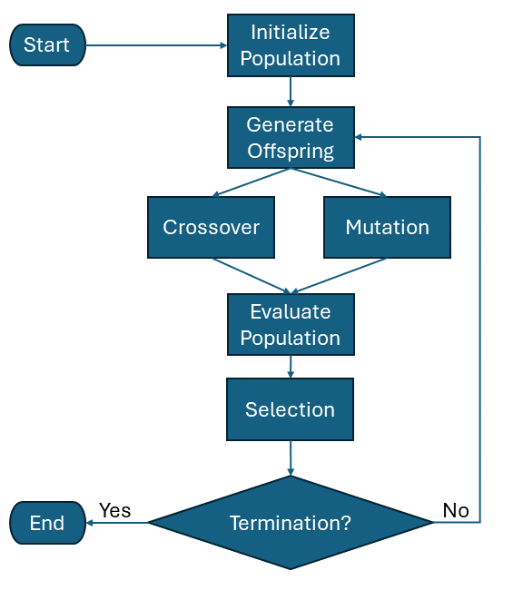
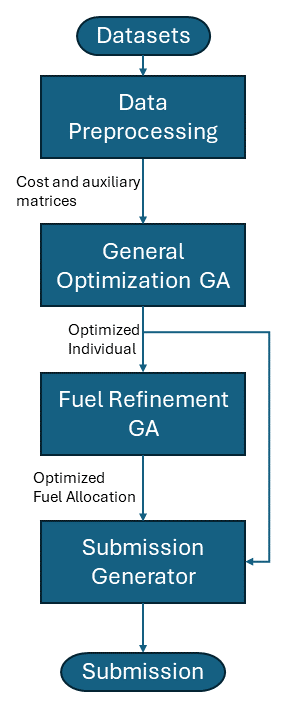
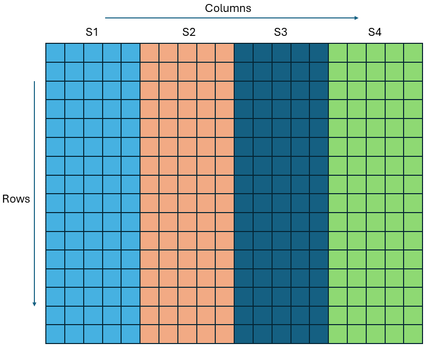
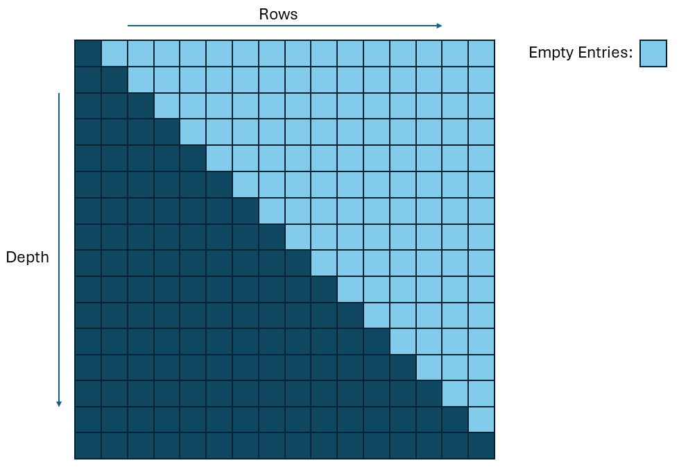
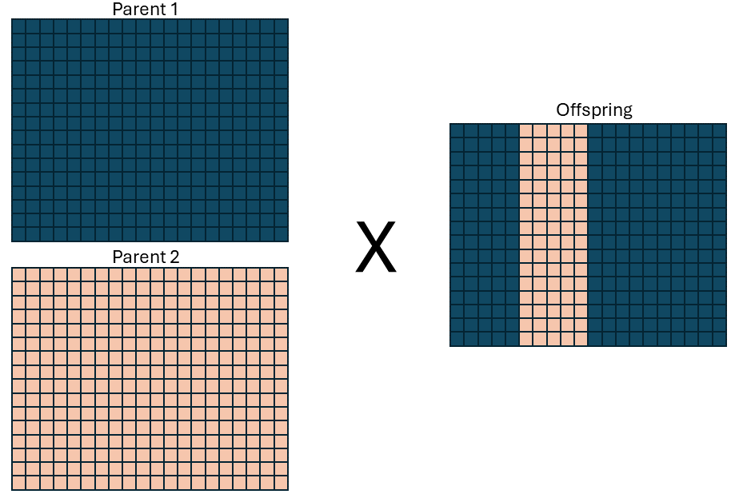

\newpage

# Abstract

This is my comprehensive document submission for Shell.ai's Hackathon for Sustainableand Affordable Energy round 2. This document contains an overview of my solution to the fleet transistion optimization problem. It consists of two genetic algoritms. A simple UI interface for the optimized code is hosted on [Streamlit Cloud](https://fleetoptimization-6gsd62jyk6xth3zdiacirj.streamlit.app/). The computational recource provided by Streamlit's free tier is limited so it is reccommended to run the code locally by cloning it from my [Fleet Opt Repo](https://github.com/raubenheimer/fleet_optimization).

\newpage
# Introduction
## Background

Professional, delivery, and operational fleets play a significant role in the global supply chain, offering flexibility, door-to-door service, and connectivity between cities and towns. However, these fleets are also a major contributor to global greenhouse gas emissions. Fleet owners face the challenge of transitioning to net-zero emissions while maintaining business sustainability and customer satisfaction. This transition involves a complex decision-making process that must account for various factors such as timing, location, and approach.

In this competition, the primary challenge is to develop an optimal fleet decarbonization strategy. This involves solving a non-linear optimization problem characterized by a large number of decision variables. The complexity of the problem arises from the need to balance multiple objectives, such as minimizing carbon emissions, meeting customer demand, and controlling operational costs.

Non-linear optimization problems with a large number of decision variables are inherently difficult to solve. The non-linearity introduces complexities that prevent straightforward solutions, requiring specialized algorithms. Moreover, the high dimensionality of the decision space means that there are numerous possible configurations and combinations of decision variables to consider, making the search for an optimal solution computationally intensive.

The optimization model must account for various constraints and objectives simultaneously. These include emission constraints, vehicle capabilities, fuel consumption rates, and other operational costs. Addressing this challenge requires robust optimization techniques capable of handling the non-linearity and the vast decision space. 

Several advanced optimization techniques can be considered for this purpose. Potential algorithms include particle swarm optimization, simulated annealing, and genetic algorithms. Each of these techniques offers unique strengths in exploring and exploiting the search space to find optimal or near-optimal solutions.

This document discusses the choice of using a genetic algorithm to address the optimization problem. The methodology, assumptions, data sources, and limitations of this approach are detailed, demonstrating how genetic algorithms can effectively balance the competing objectives and constraints in fleet decarbonization strategies.

## Fleet Transition Problem Statment

The fleet transition problem we are optimizing is stated as a Mixed-Integer Nonlinear Programming (MINLP) Problem with Nonlinear Constraints. The goal is to minimize the cost function while respecting all the constraints:

### The cost function: 
$$
C_{total} = \sum_{yr=2023}^{2038} \left( C_{buy}^{yr} + C_{ins}^{yr} + C_{mnt}^{yr} + C_{fuel}^{yr} - C_{sell}^{yr} \right)
$$

$$
C_{buy}^{yr} = \sum_{v_{yr} \in V_{yr}} C_{v_{yr}} * N_{v_{yr}}
$$

$$
C_{ins}^{yr} = \sum_{v_{yrp} \in F_{yr}} C_{v_{yrp}} * I_{(yr-yrp)}^{v_{yrp}} * N_{v_{yrp}}
$$

$$
C_{mnt}^{yr} = \sum_{v_{yrp} \in F_{yr}} C_{v_{yrp}} * M_{(yr-yrp)}^{v_{yrp}} * N_{v_{yrp}}
$$

$$
C_{fuel}^{yr} = \sum_{v \in U_{yr}} \sum_{f \in F_{v}} DS_{v}^{f} * N_{v}^{f} * m_{v}^{f} * C_{u,f}^{yr}
$$

$$
C_{sell}^{yr} = \sum_{v_{yrp} \in F_{yr}} C_{v_{yrp}} * D_{(yr-yrp)}^{v_{yrp}} * N_{yr,v_{yrp}}^{sell}
$$

### Constraints:

1. A vehicle of size Sx can only meet the demand for a bucket of size Sx.
2. Any request for distance bucket D1 to Dx can be fulfilled by any vehicle that belongs to distance bucket Dx. For instance, a car in distance bucket D4 can meet the need for buckets D1, D2, D3, and D4; in a similar vein, bucket D3 can meet the needs of buckets D1, D2, and D3 but NOT D4.
3. The annual total carbon emissions from fleet operations shall not exceed the carbon emissions limits for that year listed in carbon_emissions.csv. The annual total of carbon emissions is computed using:\
$$
Carbon_{tot}^{yr} = \sum_{v \in U_{yr}} \sum_{f \in F_{v}} DS_{v}^{f} * N_{v}^{f} * m_{v}^{f} * CE^{f}
$$

4. Every year, the entire demand for every size and distance bucket must be met.
5. Only the year 20xx vehicle model is available for purchase. Diesel_S1_2026, for instance, is only available for purchase in 2026 and cannot be purchased in any earlier or later years.
6. Each vehicles has a 10-year lifespan and needs to be sold at the conclusion of that time. A vehicles purchased in 2025, for instance, needs to be sold before the end of 2034.
7. You are unable to purchase or sell a vehicle in the middle of the year. Every purchase transaction occurs at the start of the year, and every sale transaction occurs at the conclusion of the year.
8. Only 20% of the current fleet's vehicles may be sold annually.

### Definitions:
$C_{total}$: Total cost of fleet ownership and operations across all the years.\
$C_{buy}^{yr}$: Total cost of buying vehicles in year yr.\
$C_{ins}^{yr}$: Total insurance cost incurred on the vehicles in the fleet for the year yr.\
$C_{mnt}^{yr}$: Total maintenance cost incurred on the vehicles in the fleet for year yr.\
$C_{fuel}^{yr}$: Total fuel cost incurred on the operating fleet in the year yr.\
$C_{sell}^{yr}$: Amount received by selling some vehicles in the fleet in the year yr.\
$V_{yr}$: Set of all vehicles purchased in the year yr.\
$C_{v_{yr}}$: Purchase cost of a single vehicle with ID vyr.\
$N_{v_{yr}}$: Number of vehicles of ID vyr that have been purchased.\
$F_{yr}$: Fleet of vehicles in the year yr.\
$C_{v_{yrp}}$: Cost of vehicle in fleet purchased in the year yrp. yrp is the year of purchase and yr is the year of operation such that yrp <= yr.\
$N_{v_{yrp}}$: Number of vehicles currently in the fleet in the year yrp.\
$I_{(yr-yrp)}^{v_{yrp}}$: Insurance cost in the year yr for vehicle vyrp purchased in the year yrp.\
$M_{(yr-yrp)}^{v_{yrp}}$: Maintenance cost in the year yr for vehicle vyrp purchased in the year yrp.\
$D_{(yr-yrp)}^{v_{yrp}}$: Depreciation cost in the year yr for vehicle vyrp purchased in the year yrp.\
$U_{yr}$: Vehicles being used (driven) in the year yr. This is a subset of Fyr .\
$F_{v}$: All fuel types applicable for vehicle v.\
$Ds_{v}^{f}$: Distance travelled by vehicle v using fuel f.\
$N_{v}^{f}$: Number of vehicles of type v driving fuel type f.\
$m_{v}^{f}$: Fuel Consumption of vehicle type v driving with fuel type f.\
$C_{uf,f}^{yr}$: Cost of unit fuel of type f in the year yr.\
$N_{yr,v_{yrp}}^{sell}$: Number of vehicles vyrp to be sold in the year yr.\
$Carbon_{tot}^{yr}$: Total carbon emission in the year yr.\
$CE^{f}$: Carbon emission for the fuel type f.\

All the necessary datasets can be found in the dataset folder.

## Objectives

* The solution should converge to an acceptable cost value within a reasonable amount of time
* The solution should be scalable to accommodate larger fleets and longer time periods.
* The solution should be scalable to accommodate new constraints.
* The solution should be packaged in a user-friendly way.

\newpage
# Methodology

## Overview of Genetic Algorithms

A genetic algorithm (GA) is an optimization technique inspired by the principles of natural selection and genetics. It is particularly well-suited for solving complex optimization problems with large and non-linear search spaces. The key principles and operations of a genetic algorithm are selection, crossover, and mutation. Figure 1 displays the general flow of a genetic algorithm.

{ width=230px }

### Key Principles and Operations
#### Individual:
An individual refers to a single candidate solution within the population. Each individual is typically represented as a chromosome, which can be encoded in various formats such as binary strings, real-valued vectors, or permutations, depending on the problem domain. The chromosome comprises genes, each representing a particular decision variable or a component of the solution.

#### Population:
The population is a collection of individuals. It represents the current set of candidate solutions that evolve over time through the application of genetic operators such as selection, crossover, and mutation. The population is iteratively updated to improve the quality of the solutions based on their fitness values.

#### Selection:
The selection process is analogous to natural selection where the fittest individuals are chosen to reproduce. In a genetic algorithm, a fitness function evaluates each individual in the population, assigning a fitness score based on how well it solves the problem. The selection operation then chooses individuals for reproduction, typically giving a higher probability to those with better fitness scores. Common selection methods include roulette wheel selection, tournament selection, and rank-based selection.

#### Crossover:
Crossover is a genetic operator used to combine the genetic information of two parents individuals to produce new offspring. This operation mimics biological reproduction. The crossover process typically involves selecting a crossover point on the parents' chromosome and exchanging the segments beyond this point between the two parents. Common crossover techniques include one-point crossover, two-point crossover, and uniform crossover. The goal is to produce offspring that inherit the best traits from both parents.

#### Mutation:
Mutation introduces genetic diversity into the population by randomly altering the genes of individuals. This operation prevents the algorithm from becoming stuck in local optima by ensuring a wider exploration of the search space. Mutation is typically performed with a low probability, modifying one or more genes in an individual's chromosome. Common mutation techniques include bit-flip mutation for binary representations and Gaussian mutation for real-valued representations.
Real-World Applications and References
Genetic algorithms are used in various fields, including engineering, economics, bioinformatics, and artificial intelligence, for tasks such as scheduling, design optimization, and machine learning.

## Why a Genetic Algorithm?

Genetic algorithms (GAs) are particularly effective for Mixed-Integer Nonlinear Programming (MINLP) Problems. The fleet optimization problem has a complex, irregular, and discontinuous search space. GAs do not require gradient information or smoothness in the search space, making them suitable for problems where traditional optimization methods may fail. GAs perform a global search rather than a local search. This means they explore a wide range of potential solutions in the search space, which helps in avoiding local optima.

Genetic algorithms are easily parallelized because the evaluation and operations on individuals within the population can be performed simultaneously. This parallelism can be exploited to speed up the search process, especially in large decision spaces where evaluating all possible solutions sequentially would take an unreasonable amount of time.

These two reasons – the ability to handle complex, non-smooth search spaces and the potential for parallelization to enhance computational efficiency – are why a Genetic Algorithm was selected for the solution.

## Assumptions
The following assumptions were made in the development and implementation of the solution: 

1. Having a vehicle that drives 0km in a year adds to the total cost without providing any other benefit. It only makes sense to keep a vehicle or acquire a new one if it will be utilized. This means that all vehicles in the fleet will always drive non-zero km per year. 
2. Oversatisfying the yearly demand adds to the fuel cost without any benefit. This means that only a total of ceil(yearly_bucket_demand/yearly_vehicle_range) vehicles are required for each bucket. Consequently, we do not need to decide on the number of vehicles required for each year, since we can precompute the number for each demand bucket.
3. The only time it makes sense to drive less than a vehicle's yearly range is when it would mean that the yearly demand would be exceeded. This means that if yearly_bucket_demand = n*yearly_vehicle_range for some integer n then n vehicles will drive the total yearly range. And if yearly_bucket_demand/yearly_vehicle_range is not an integer there are ceil(yearly_bucket_demand/yearly_vehicle_range) - 1 "demand slots" where the allocated vehicle drives its total yearly range and one "demand slot" where a vehicle drives mod(yearly_bucket_demand/yearly_vehicle_range) km.
4. For years < 2032 there is a ceiling on the amount of BEVs that can be utilized since the electric vehicles (EVs) are restricted to certain demand buckets for years < 2032. 

## Algorithm Design

The solution can be broken into four main components:

1. **Data Preprocessing**: In this step the input datasets are used to generate cost and auxiliary arrays and matrices. These matrices are used in the GAs.
2. **General Optimization GA**: This is where the bulk of the optimization happens. This step determines which vehicles get bought and sold. It is described in detail in section 2.3.1
3. **Fuel Refinement GA**: This is where the fuel allocation gets optimized based on the vehicles that are present in the optimized individual.
4. **Submission Generator**: This is where the costom representation of the individual gets translated into the standard submission format.

{ width=130px }

### General Optimization GA

This is where the main optimization occurs. The General Optimization GA is a $\mu$+$\lambda$ evolutionary algorithm. The algorithm begins by initializing a population of size $\mu$ . This population is evaluated, and a new set of offspring is produced by applying crossover and mutation operators to individuals in the initial population. The number of offspring produced is equal to $\lambda$ . The next generation is selected from the original population of size $\mu$  and the offspring of size $\lambda$  (hence $\mu$ +$\lambda$ ). This evolutionary process is repeated for a predetermined number of generations. The individual with the lowest cost is then returned as the optimal solution.

The algorithm has the following hyperparameters:

* **$\mu$  (mu)**: The number of individuals to select for the next generation.
* **$\lambda$  (lambda)**: The number of offspring individuals to generate from the population of size mu.
* **mutation chance**: The chance that an individual from the original population will be mutated to produce a new individual.
* **crossover chance**: The chance that crossover will be applied to two individuals from the original population to produce a new individual.
* **number of generations**: The number of generations that the evolutionary algorithm should be run.

The following sections give a detailed description of each part of the algorithm.

#### Individual Representation:
Each individual is represented as a 3-dimensional array of integers. This array has dimension (16,16,20) where each dimension will be referred to as (depth,rows,columns) respectfully. An individual can be imagined as a block composed of 16 x 16 x 20 entries. The number in each entry directly refers to vehicles of a specific type. Each column in the block represents a different fuel type and size class pair:\
| S1 Electricity | S1 HVO | S1 B20 | S1 LNG | S1 BioLNG | S2 Electricity | S2 HVO | S2 B20 | S2 LNG | S2 BioLNG | ..... | S4 BioLNG |\
Each row represents the year the vehicles were bought in. Each depth slice of the array represents the year that the vehicles are part of the fleet. So for example:

* (0,0,0) = 5: this represents that 5 S1 EVs were bought in 2023
* (15,14,6) = 3: this represents that 3 S2 Diesels that were bought in 2037 are being used in 2038 and that these diesels vehicles are running on HVO.

Figures 3 and 4 display the layout of an individual. Figure 4 illustrates the fact that if row>depth then the entry must be equal to 0, since we cannot use vehicles from the future in the current year.

{ width=300px }

{ width=400px }


This representation has a few advantages:

* It is compact which means that it has a smaller memory footprint.
* Contains all the information needed to generate a solution.
* We can use fast Python libraries to act on our arrays.
* The representation is easy to interpret and it does not have to be modified to be read by a human.
* The total vehicles in the fleet for each year can easily be calculated by summing that year's depth slice.
* The vehicles that are sold each year can be calculated by deducting the depth slice below it. ????
An example of an individual is provided in the Appendix.

#### Population Initialization: 
At the start of the algorithm, a population is initialized. The function responsible for creating these individuals is create_individual(), located in the utils.gen_funcs.py module. This function generates a random valid individual. By "valid," it means that the vehicles are properly accounted for, but it does not ensure that all constraints are met. Therefore, an individual might still contain vehicles kept for longer than 10 years or have a fuel spread that exceeds the emissions cap for a year.

The initial population size, denoted by $\mu$ , is a parameter defined by the user. The create_individual() function is called $\mu$  times to generate the initial population, ensuring that each individual is unique and maintains a high level of diversity.

The fitness function, discussed later, is responsible for weeding out individuals that do not meet the constraints. The create_individual() function guarantees only that the produced individuals have a valid fleet inventory and that the population's diversity is sufficient for fast initial convergence.

Example:\
For instance, if $\mu$  is set to 100, the create_individual() function will generate 100 distinct individuals, each representing a potential fleet configuration. These configurations will include various combinations of vehicle types, ages, and fuel usages, providing a diverse starting point for the optimization process.

In summary, the population initialization step sets the stage for the genetic algorithm by creating a diverse set of candidate solutions, which will then be refined through the evolutionary process.

#### Mutation Method: 
The mutate() function is one of the functions called during the creation of offspring, located in the utils.gen_funcs.py module. It is responsible for modifying an existing individual so that the solution search space "around" that individual can be explored. There are three types of mutations that are applied to an individual:

* **Buy Reshuffle**: A year and a size class are randomly selected. All the vehicles of this size class, bought in this year are reshuffled. For example, if 5 EVs can be reshuffled to 3 diesel and 2 LNG vehicles. The fuel allocation is also randomized for the new spread of vehicles.
* **Fuel Reshuffle**: A year and size class are randomly selected. The fuel allocation of the vehicles in this size class are reshuffled from the selected year to the final year. For example, if 2 diesels were allocated to run on HVO and 2 on B20 the reshuffel might result in 3 running on HVO and 1 running on B20. This mutation preserves the number of EVs, diesels and LNGs.
* **Single Vehicle Mutation**: This mutation randomly selects a single vehicle contained in the individual and then mutates its type, fuel allocation and the year that it is sold in.

Only one of the mutations is applied per call. All of them contain extra logic to ensure that the vehicles are properly accounted for and sometimes lead to other parts of the individual being mutated to ensure that the new individual is valid. These mutation were chosen because they provide the right mixture of large and small steps through the search space. This ensures that the population does not get stuck in local minima and that the optimization does not converge too slowly.

#### Crossover Method: 
The mate() function is the other function that is called to create new offspring, located in the utils.gen_funcs.py module. It takes two individuals as input and returns a new offspring individual that is a mixture of the two. A random size class is selected and this size class is then swapped between the two individuals. For example, if S1 is selected the columns 0 to 4 are swapped and a new individual is produced that has columns 0 to 4 from the first parent and 5 to 19 from the second parent. Figure 5 shows an example of a depth slice where S2 was selected.

{ width=300px }
  
#### Fitness Function: 
The evaluate() function is responsible for calculating an individual's fitness/cost and penalising  individuals that do not meet the constraints. The steps that the evaluate function does the following:

1. **Checks Constraints**: The function checks if constraints 2,3,6,8 mentioned in section 1.3 are violated. All the other constraints are inherently respected by the way the solution is set up. If any of these constraints are violated a hefty penalty is added to the individual's cost and the function even returns early on some violations to save processing time. 
2. **Calculates $C_{buy}$, $C_{ins}$ and $C_{mnt}$ Cost Terms**: If the individual does not violate any of the constraints where the functions returns early these cost terms are calculated. Each of these terms is calculated by taking the Hadamard product of the individual and a precomputed cost array of the same shape. The sum of each resulting array is calculated. The resulting sum of these results represent $C_{buy}$ + $C_{ins}$ + $C_{mnt}$.
Section ?? provides more information about the precomputed cost arrays.
3. **Calculate $C_{sell}$**: The amount of vehicles sold in each year is calculated by the get_sold() function. This function returns an array with shape (16,16,12). Its columns represent the size classes (S1/S2/S3/S4) and vehicle types (EV/Diesel/LNG) combinations (4x3) and the value in each entry is the number of vehicles sold in that specific year. The Hadamard product of this array and a precomputed cost array of the same shape is taken and the sum of the resulting array is $C_{sell}$.
4. **Conduct Simple Fuel Optimization and Calculate $C_{fuel}$**: The evalution function performs a simple fuel allocation oprimization. In this step, all the demand buckets are assigned a fuel from the individual based on a simple greedy minimization algorithm. The optimum allocation cannot be used, since it is also an Integer Programming problem and would take too long to calculate. The $C_{fuel}$ term is then calculated from the greedy allocation by calculating $DS_{v}^{f} * m_{v}^{f} * C_{u,f}^{yr}$ for each demand bucket and summing all the results.

#### Selection Method: 
The selection function used in this algorithm is elitist selection (or truncation selection). In this method, individuals are ranked based on their fitness scores, and the top $\mu$  individuals with the highest fitness values (the lowest costs) are chosen to form the next generation. This approach ensures that the best solutions are preserved, promoting convergence towards optimal solutions while maintaining a high quality of individuals in the population.


### Fuel Refinement GA
The fuel refinement GA is the second optimization step in the solution. Its purpose is to take the optimized list of vehicles produced by the General Optimization GA and assign each vehicle to a demand slot such that the total fuel cost it minimized. Each demand slot is represented as a 1-D array with 5 entries. The table below describes what each entry represents:

| Slot Idx | Slot Name    | Slot Description |
|----------|--------------|------------------|
| 0        | Size Class   | An integer between 0 and 3 representing the size class SX |
| 1        | Bucket Class | An integer between 0 and 3 representing the size class DX |
| 2        | Year Bought  | An integer between 0 and 15 representing the year the vehicle was bought in |
| 3        | Demand       | The demand slot's required demand in km |
| 4        | Fuel         | An integer between 0 and 4 representing the slot's assigned fuel type |

The Fuel Refinement GA starts off with a list of these demand slots. The 0,1 and 3 entries are fixed and cannot be modified by the algorithm. These demand slots are generated based on the logic mentioned in the Assumptions Section. The Fuel Refinement GA optimizes each year's fuel cost separately. This is possible since the available vehicles are already set in stone by the General Optimization GA. Optimizing on a per-year basis is an andvantages because it greatly reduces the size of the search space that the GA has to explore. The pseudo-code for this algorithm is as follows:

```
Function Main:
    Initialize constants and parameters:
        - type_sum_matrix
        - max_ranges_per_size
        - vehicle and fuel mappings
        - number of generations, probabilities for mating and mutating
        - lambda (number of offspring), mu (population size)

    Create data structures for optimization
    For each year in the range:
        Setup individual parameters:
            - Extract relevant depth slice from the optimized individual
            - Initialize year-specific variables
            - Calculate demand slots based on size and bucket demands

        Calculate size cutoffs for slots

        Retrieve fuel costs, emissions, and constraints for the current year

        Create initial population for the year
        Evaluate the fitness of the initial population

        Set early stopping conditions

        For each generation up to n_gen:
            Evolve the population:
                - Select, mutate, and crossover individuals
                - Evaluate new population fitness

            Track best fitness

            Implement early stopping if no improvement

        Store the best individual for the current year in the results dictionary

End Function
```

The terminology used in this code block is clarified and discussed in the following sections.

#### Encoding: 

To avoid confusion the Fuel Refinement GA's individuals that make up the population are referred to as demand slot arrays and the individual from the General Optimization GA is referred to as the optimized individual. A demand slot array is an array of demand slots. Each demand slot array has the same amount of entries as the number of vehicles on hand for the year being optimized. This number is calculated by summing the entries in the depth slice of the optimized individual that correspond to the $C_{fuel}^{yr} being optimized.

The demand slots are ordered by Size class and demand buckets. So the demand slots for S1,D1 appear first and those for S4,D4 appear last. The point where one size class' demand slots start is important because they are used by the crossover and mutation operations to ensure that valid demand slot arrays are produced. These points in a demand slot array are referred to as size cutoffs. They are calculated and stored when the optimization is initialized.

#### Population Initialization: 

The fuel_create_individual() function is responsible for creating valid demand slot arrays for population initialization. It assigns random vehicles from our optimized individual to the demand slots. The size cutoffs are used to ensure that Size Class and vehicle types match up. 

#### Crossover Method: 

The fuel_mate() function is responsible for crossover. It takes two demand slot arrays and generates a new offspring demand slot array. The function exchanges a random number of size class ranges (1-4) between the first and second parent arrays and returns the child so that it can be appended to the offspring. Here is the pseudo-code:

```
Function fuel_mate(demand_slot_arr_1, demand_slot_arr_2, size_cut_offs):
    Randomly select the number of sizes to switch (between 1 and 3)
    Randomly choose sizes to switch

    For each selected size:
        Determine start and end indices based on size_cut_offs
        Copy the segment from individual_2 corresponding to these indices
        Replace the segment in individual_1 with the copied segment

    Return the new demand_slot_arr
```

#### Mutation Method: 

The fuel_mutate() function is responsible for mutating existing demand slot arrays. There are two main mutations that are applied:

**Fuel Flip**: Select a random demand slot. If the vehicle in the randomly selected demand slot is a Diesel or LNG flip the fuel type.
**Vehicle Swap**: Two slots of the same size class are randomly selected and the vehicles are exchanged.

The pseudo-code:
```
Function fuel_mutate(demand_slot_arr, size_cut_offs):
    Define a mapping for fuel choices

    For each size index from 0 to 3:
        Extract slots for the current size using size_cut_offs

        Randomly select a slot within the current size slots
        Get the current fuel choice for the selected slot
        Change the fuel choice using the fuel map

        Randomly select two distinct slots within the current size slots
        Swap vehicle types and fuel choices between the two selected slots

    Return the new mutated demand_slot_arr
```

#### Fitness Function: 

The fuel_evaluate() function is responsible for assigning a fitness value to each demand slot array in the population. It also applies a penalty to a demand slot array if:

1. The fuels assigned to each vehicle result in the emissions cap being exceeded.
2. There are vehicles assigned to demand buckets that violate constraint 2.

The pseudo-code for this function:

```
Function fuel_evaluate(demand_slot_arr, year_fuel_costs_mat, year_fuel_emissions_mat, emissions_cap):
    Initialize fuel_cost to 0
    Initialize emissions to 0

    For each slot in the individual:
        Extract slot properties: size, bucket, model year, range, and fuel type

        Calculate and accumulate fuel cost:
            fuel_cost += cost from year_fuel_costs_mat for the slot's model year, size, and fuel type, multiplied by slot range

        Calculate and accumulate emissions:
            emissions += emissions from year_fuel_emissions_mat for the slot's model year, size, and fuel type, multiplied by slot range

        If vehicle type is BEV and model year is less than 9:
            Apply penalty to fuel cost based on bucket constraints:
                If model year <= 2 and bucket > 0, add penalty
                If model year <= 5 and bucket > 1, add penalty
                If model year <= 8 and bucket > 2, add penalty

    If total emissions exceed emissions_cap:
        Add penalty to fitness score

    Set fitness equal to the calculated fuel cost

    Return fitness
```

#### Selection Method: 
The selection function used in this algorithm is also elitist selection.

## Algorithm Implementation

### Languages and Tools
All of the code for this solution is written in Python. The following packages were used to aid in the creation of this solution:

* Numpy: A fundamental package for scientific computing in Python, providing support for large multi-dimensional arrays and matrices, along with a collection of mathematical functions to operate on these arrays efficiently. Numpy is extensively used throughout the entire solution. It is used to ease the mamipulation of arrays and because of its speed and synergy with Numba.
* Numba: A just-in-time compiler for Python that translates a subset of Python and NumPy code into fast machine code, enabling high-performance execution of numerical functions. Numba is extensively used in both GAs. Without Numba these algorithms would be orders of magnitude slower. Numba is used to compile almost all the functions in the GAs and to parallelise the workload across multiple CPU cores.
* Pandas: A powerful data manipulation and analysis library for Python, offering data structures like DataFrame and Series to handle structured data and providing tools for data cleaning, preparation, and analysis. It is used in the preprocessing and submission generation to transform the data into the required formats.
* Streamlit: An open-source app framework for creating and sharing custom web applications for machine learning and data science projects. It allows users to build interactive and visually appealing applications with minimal code. This package is used for the solution's simple front-end.

### Suggested Hyperparameters
The hyperparameters, except for the number of generations, for both GAs were selected after a grid search was conducted. The number of generations was selected based off of when the algorithm converged.

| Hyperparameter | General Optimization GA | Fuel Refinement GA |
|----------------|-------------------------|--------------------|
| Number of generations | 5000 | 1000 |
| Lambda                | 14000 | 4000 |
| Mu                    | 6000 | 1000 |
| Mutation Chance       | 0.5 | 0.95 |
| Crossover Chance      | 0.5 | 0.05 |

# Data Preprocessing
The provided CSVs are used to calculate all the required costs and axillary arrays. The calc_cost_mats() function that generates these arrays can be found in the utils.data_funcs.py module. These arrays are discussed in this section and one of them is listed in the appendix.

## buy_cost_mat

The buy_cost_mat is used to calculate the $C_{buy}$ term in the cost function. It's calculated from the data contained in the vehicles.csv file. It is an array with shape (16,16,12). It only has entries on the rows where the row and depth index are equal. These entries are just the cost of each vehicle type for the year in question. The buy_cost_mat is listed in the appendix.

## insure_cost_mat

The insure_cost_mat is used to calculate the $C_{ins}$ term in the cost function. It is calculated from the data contained in the cost_profiles.csv and vehicles.csv files. It is an array with shape (16,16,12). Here the entries represent how much the insurance on a vehicle will cost for a specific vehicle type with a specific age. This array also contains penalty terms for vehicles that are older than 10 years. 

## maintaine_cost_mat

The insure_cost_mat is used to calculate the $C_{mnt}$ term in the cost function. It is calculated from the data contained in the cost_profiles.csv and vehicles.csv files in a similar fashion as the insure_cost_mat. It is an array with shape (16,16,12). Here the entries represent how much the maintenance on a vehicle will cost for a specific vehicle type with a specific age. This array also contains penalty terms for vehicles that are older than 10 years. 

## sell_cost_mat
The sell_cost_mat is used to calculate the $C_{sell}$ term in the cost function. It is calculated from the data contained in the cost_profiles.csv and vehicles.csv files in a similar fashion as the insure_cost_mat. It is an array with shape (16,16,12). Here the entries represent how much a vehicle will sell for based on the specific vehicle type and age. This array also contains penalty terms for vehicles that are older than 10 years. 

## min_veh_dict & max_evs_dict

The min_veh_dict is a Python dictionaries that provide the amount of vehicles that are required for each year and size class SX. It is calculated from the bucket demand data. The max_evs_dict is a Python dictionaries that provide the maximum amount of BEVs that can be on hand for each year and each size class SX. These two dictionaries are used by the create_individual() and mutate() functions to ensure that the correct amount of vehicles are on hand in each individual. 

# Limitations

## Model Limitations:

* **Fuel Cost Term Separation**: The biggest limitation that this solution has is that the fuel cost term is optimized in a separate step. This means that the solution's cost function does not match the actual cost function exactly. It must be mentioned that this limitation has been managed as much as possible by including the greedy fuel optimization step in the evaluation of the General Optimization GA. 
* **Scaling Down**: This solution is much better suited for scaling up than it is for scaling down. When the search space is scaled down it makes much more sense to make use of traditional branch and bound or cutting plane algorithms, since these algorithms are guaranteed to find the global minima of the cost function. This solution can still be used as a warm start for the scaled-down versions of the problem.

## Computational Limitations

* **Single Threaded Code**: The offspring generation code is run on a single thread. This is the largest bottle neck in the current implementation of the solution.
* **Memory Scaling**: The solution might become very memory-heavy when the number of years is scaled up since an individual's size increases by the square of the amount of years. This means that the population size will be capped leading to slower convergence. It must be mentioned that the current problem size of 16 years does not have this problem and that it does not make sense to plan too far in advance because of operational uncertainties.
* **Sequential Fuel Optimization**: It is possible to parallelize the optimization of each year's demand slot optimization in the Fuel Refinement GA since they are independent of one another. This has not been done becasue of limitations that exsist in the solution's current tech stack. This is currenlty slowing down the time it takes the solution to optimize.

# Conclusion

In addressing the complex problem of fleet decarbonization, the solution presented leverages a genetic algorithm to navigate the intricacies of a Mixed-Integer Nonlinear Programming (MINLP) problem. This approach effectively handles the non-linearities and high dimensionality inherent in optimizing fleet operations over a multi-year period. The genetic algorithm was chosen due to its ability to explore a vast search space and its flexibility in adapting to the diverse constraints imposed by operational, economic, and environmental requirements.

The optimization model focuses on minimizing total fleet costs while ensuring compliance with emissions constraints and meeting all customer demand requirements. By implementing this model, the solution achieves a balance between reducing carbon emissions and maintaining fleet operational efficiency. The method considers various cost factors, including purchase, insurance, maintenance, fuel, and depreciation, while respecting vehicle lifespan and sale constraints.

Key objectives, such as convergence to an acceptable cost, scalability for larger fleets and time frames, and adaptability to new constraints, have been integral to the solution's design. The genetic algorithm’s parallel processing capability enhances its efficiency, allowing for quick exploration and solution refinement.

This solution framework provides a flexible and robust decision-making tool for fleet owners aiming to transition towards net-zero emissions while maintaining business sustainability. By packaging the solution in a user-friendly format, stakeholders can easily interact with the model, making it accessible for strategic planning and operational adjustments.

The successful application of this optimization model demonstrates the potential for advanced algorithms to solve complex, real-world challenges in fleet management and offers a pathway to sustainable fleet operations that align with environmental goals.

# References
Goldberg, D. E. (1989). Genetic Algorithms in Search, Optimization, and Machine Learning. Addison-Wesley.

Mitchell, M. (1998). An Introduction to Genetic Algorithms. MIT Press.

Holland, J. H. (1975). Adaptation in Natural and Artificial Systems. University of Michigan Press.

# Appendix

## Individual Example

$$
2023:
\begin{bmatrix}
8 & 0 & 32 & 0 & 33 & 0 & 0 & 0 & 29 & 5 & 14 & 0 & 27 & 5 & 35 & 0 & 0 & 0 & 11 & 0 \\
0 & 0 & 0 & 0 & 0 & 0 & 0 & 0 & 0 & 0 & 0 & 0 & 0 & 0 & 0 & 0 & 0 & 0 & 0 & 0 \\
0 & 0 & 0 & 0 & 0 & 0 & 0 & 0 & 0 & 0 & 0 & 0 & 0 & 0 & 0 & 0 & 0 & 0 & 0 & 0 \\
0 & 0 & 0 & 0 & 0 & 0 & 0 & 0 & 0 & 0 & 0 & 0 & 0 & 0 & 0 & 0 & 0 & 0 & 0 & 0 \\
0 & 0 & 0 & 0 & 0 & 0 & 0 & 0 & 0 & 0 & 0 & 0 & 0 & 0 & 0 & 0 & 0 & 0 & 0 & 0 \\
0 & 0 & 0 & 0 & 0 & 0 & 0 & 0 & 0 & 0 & 0 & 0 & 0 & 0 & 0 & 0 & 0 & 0 & 0 & 0 \\
0 & 0 & 0 & 0 & 0 & 0 & 0 & 0 & 0 & 0 & 0 & 0 & 0 & 0 & 0 & 0 & 0 & 0 & 0 & 0 \\
0 & 0 & 0 & 0 & 0 & 0 & 0 & 0 & 0 & 0 & 0 & 0 & 0 & 0 & 0 & 0 & 0 & 0 & 0 & 0 \\
0 & 0 & 0 & 0 & 0 & 0 & 0 & 0 & 0 & 0 & 0 & 0 & 0 & 0 & 0 & 0 & 0 & 0 & 0 & 0 \\
0 & 0 & 0 & 0 & 0 & 0 & 0 & 0 & 0 & 0 & 0 & 0 & 0 & 0 & 0 & 0 & 0 & 0 & 0 & 0 \\
0 & 0 & 0 & 0 & 0 & 0 & 0 & 0 & 0 & 0 & 0 & 0 & 0 & 0 & 0 & 0 & 0 & 0 & 0 & 0 \\
0 & 0 & 0 & 0 & 0 & 0 & 0 & 0 & 0 & 0 & 0 & 0 & 0 & 0 & 0 & 0 & 0 & 0 & 0 & 0 \\
0 & 0 & 0 & 0 & 0 & 0 & 0 & 0 & 0 & 0 & 0 & 0 & 0 & 0 & 0 & 0 & 0 & 0 & 0 & 0 \\
0 & 0 & 0 & 0 & 0 & 0 & 0 & 0 & 0 & 0 & 0 & 0 & 0 & 0 & 0 & 0 & 0 & 0 & 0 & 0 \\
0 & 0 & 0 & 0 & 0 & 0 & 0 & 0 & 0 & 0 & 0 & 0 & 0 & 0 & 0 & 0 & 0 & 0 & 0 & 0 \\
0 & 0 & 0 & 0 & 0 & 0 & 0 & 0 & 0 & 0 & 0 & 0 & 0 & 0 & 0 & 0 & 0 & 0 & 0 & 0 \\
\end{bmatrix}\\
$$
$$
2024:
\begin{bmatrix}
8 & 0 & 31 & 3 & 30 & 0 & 0 & 0 & 31 & 0 & 13 & 0 & 25 & 13 & 27 & 0 & 0 & 0 & 7 & 0 \\
0 & 0 & 0 & 2 & 0 & 0 & 0 & 0 & 3 & 0 & 0 & 0 & 0 & 5 & 0 & 0 & 0 & 0 & 4 & 0 \\
0 & 0 & 0 & 0 & 0 & 0 & 0 & 0 & 0 & 0 & 0 & 0 & 0 & 0 & 0 & 0 & 0 & 0 & 0 & 0 \\
0 & 0 & 0 & 0 & 0 & 0 & 0 & 0 & 0 & 0 & 0 & 0 & 0 & 0 & 0 & 0 & 0 & 0 & 0 & 0 \\
0 & 0 & 0 & 0 & 0 & 0 & 0 & 0 & 0 & 0 & 0 & 0 & 0 & 0 & 0 & 0 & 0 & 0 & 0 & 0 \\
0 & 0 & 0 & 0 & 0 & 0 & 0 & 0 & 0 & 0 & 0 & 0 & 0 & 0 & 0 & 0 & 0 & 0 & 0 & 0 \\
0 & 0 & 0 & 0 & 0 & 0 & 0 & 0 & 0 & 0 & 0 & 0 & 0 & 0 & 0 & 0 & 0 & 0 & 0 & 0 \\
0 & 0 & 0 & 0 & 0 & 0 & 0 & 0 & 0 & 0 & 0 & 0 & 0 & 0 & 0 & 0 & 0 & 0 & 0 & 0 \\
0 & 0 & 0 & 0 & 0 & 0 & 0 & 0 & 0 & 0 & 0 & 0 & 0 & 0 & 0 & 0 & 0 & 0 & 0 & 0 \\
0 & 0 & 0 & 0 & 0 & 0 & 0 & 0 & 0 & 0 & 0 & 0 & 0 & 0 & 0 & 0 & 0 & 0 & 0 & 0 \\
0 & 0 & 0 & 0 & 0 & 0 & 0 & 0 & 0 & 0 & 0 & 0 & 0 & 0 & 0 & 0 & 0 & 0 & 0 & 0 \\
0 & 0 & 0 & 0 & 0 & 0 & 0 & 0 & 0 & 0 & 0 & 0 & 0 & 0 & 0 & 0 & 0 & 0 & 0 & 0 \\
0 & 0 & 0 & 0 & 0 & 0 & 0 & 0 & 0 & 0 & 0 & 0 & 0 & 0 & 0 & 0 & 0 & 0 & 0 & 0 \\
0 & 0 & 0 & 0 & 0 & 0 & 0 & 0 & 0 & 0 & 0 & 0 & 0 & 0 & 0 & 0 & 0 & 0 & 0 & 0 \\
0 & 0 & 0 & 0 & 0 & 0 & 0 & 0 & 0 & 0 & 0 & 0 & 0 & 0 & 0 & 0 & 0 & 0 & 0 & 0 \\
0 & 0 & 0 & 0 & 0 & 0 & 0 & 0 & 0 & 0 & 0 & 0 & 0 & 0 & 0 & 0 & 0 & 0 & 0 & 0 \\
\end{bmatrix}\\
$$
$$
2025:
\begin{bmatrix}
 6 & 0 & 28 & 6 & 26 & 0 & 0 & 0 & 18 & 1 & 11 & 0 & 24 & 26 & 12 & 0 & 0 & 0 & 1 & 0 \\
  0 & 0 & 0 & 1 & 0 & 0 & 0 & 0 & 1 & 0 & 0 & 0 & 0 & 1 & 0 & 0 & 0 & 0 & 3 & 0 \\
  0 & 0 & 0 & 7 & 2 & 0 & 0 & 0 & 14 & 1 & 0 & 0 & 0 & 10 & 0 & 0 & 0 & 0 & 7 & 0 \\
  0 & 0 & 0 & 0 & 0 & 0 & 0 & 0 & 0 & 0 & 0 & 0 & 0 & 0 & 0 & 0 & 0 & 0 & 0 & 0 \\
  0 & 0 & 0 & 0 & 0 & 0 & 0 & 0 & 0 & 0 & 0 & 0 & 0 & 0 & 0 & 0 & 0 & 0 & 0 & 0 \\
  0 & 0 & 0 & 0 & 0 & 0 & 0 & 0 & 0 & 0 & 0 & 0 & 0 & 0 & 0 & 0 & 0 & 0 & 0 & 0 \\
  0 & 0 & 0 & 0 & 0 & 0 & 0 & 0 & 0 & 0 & 0 & 0 & 0 & 0 & 0 & 0 & 0 & 0 & 0 & 0 \\
  0 & 0 & 0 & 0 & 0 & 0 & 0 & 0 & 0 & 0 & 0 & 0 & 0 & 0 & 0 & 0 & 0 & 0 & 0 & 0 \\
  0 & 0 & 0 & 0 & 0 & 0 & 0 & 0 & 0 & 0 & 0 & 0 & 0 & 0 & 0 & 0 & 0 & 0 & 0 & 0 \\
  0 & 0 & 0 & 0 & 0 & 0 & 0 & 0 & 0 & 0 & 0 & 0 & 0 & 0 & 0 & 0 & 0 & 0 & 0 & 0 \\
  0 & 0 & 0 & 0 & 0 & 0 & 0 & 0 & 0 & 0 & 0 & 0 & 0 & 0 & 0 & 0 & 0 & 0 & 0 & 0 \\
  0 & 0 & 0 & 0 & 0 & 0 & 0 & 0 & 0 & 0 & 0 & 0 & 0 & 0 & 0 & 0 & 0 & 0 & 0 & 0 \\
  0 & 0 & 0 & 0 & 0 & 0 & 0 & 0 & 0 & 0 & 0 & 0 & 0 & 0 & 0 & 0 & 0 & 0 & 0 & 0 \\
  0 & 0 & 0 & 0 & 0 & 0 & 0 & 0 & 0 & 0 & 0 & 0 & 0 & 0 & 0 & 0 & 0 & 0 & 0 & 0 \\
  0 & 0 & 0 & 0 & 0 & 0 & 0 & 0 & 0 & 0 & 0 & 0 & 0 & 0 & 0 & 0 & 0 & 0 & 0 & 0 \\
  0 & 0 & 0 & 0 & 0 & 0 & 0 & 0 & 0 & 0 & 0 & 0 & 0 & 0 & 0 & 0 & 0 & 0 & 0 & 0 \\
\end{bmatrix}\\
$$
$$
2026:
\begin{bmatrix}
 6 & 0 & 25 & 17 & 8 & 0 & 0 & 0 & 10 & 0 & 8 & 0 & 20 & 13 & 23 & 0 & 0 & 0 & 0 & 0 \\
  0 & 0 & 0 & 0 & 0 & 0 & 0 & 0 & 0 & 0 & 0 & 0 & 0 & 0 & 0 & 0 & 0 & 0 & 0 & 0 \\
  0 & 0 & 0 & 8 & 0 & 0 & 0 & 0 & 10 & 3 & 0 & 0 & 0 & 7 & 0 & 0 & 0 & 0 & 7 & 0 \\
  0 & 0 & 0 & 12 & 2 & 0 & 0 & 0 & 10 & 2 & 0 & 0 & 0 & 15 & 1 & 0 & 0 & 0 & 4 & 0 \\
  0 & 0 & 0 & 0 & 0 & 0 & 0 & 0 & 0 & 0 & 0 & 0 & 0 & 0 & 0 & 0 & 0 & 0 & 0 & 0 \\
  0 & 0 & 0 & 0 & 0 & 0 & 0 & 0 & 0 & 0 & 0 & 0 & 0 & 0 & 0 & 0 & 0 & 0 & 0 & 0 \\
  0 & 0 & 0 & 0 & 0 & 0 & 0 & 0 & 0 & 0 & 0 & 0 & 0 & 0 & 0 & 0 & 0 & 0 & 0 & 0 \\
  0 & 0 & 0 & 0 & 0 & 0 & 0 & 0 & 0 & 0 & 0 & 0 & 0 & 0 & 0 & 0 & 0 & 0 & 0 & 0 \\
  0 & 0 & 0 & 0 & 0 & 0 & 0 & 0 & 0 & 0 & 0 & 0 & 0 & 0 & 0 & 0 & 0 & 0 & 0 & 0 \\
  0 & 0 & 0 & 0 & 0 & 0 & 0 & 0 & 0 & 0 & 0 & 0 & 0 & 0 & 0 & 0 & 0 & 0 & 0 & 0 \\
  0 & 0 & 0 & 0 & 0 & 0 & 0 & 0 & 0 & 0 & 0 & 0 & 0 & 0 & 0 & 0 & 0 & 0 & 0 & 0 \\
  0 & 0 & 0 & 0 & 0 & 0 & 0 & 0 & 0 & 0 & 0 & 0 & 0 & 0 & 0 & 0 & 0 & 0 & 0 & 0 \\
  0 & 0 & 0 & 0 & 0 & 0 & 0 & 0 & 0 & 0 & 0 & 0 & 0 & 0 & 0 & 0 & 0 & 0 & 0 & 0 \\
  0 & 0 & 0 & 0 & 0 & 0 & 0 & 0 & 0 & 0 & 0 & 0 & 0 & 0 & 0 & 0 & 0 & 0 & 0 & 0 \\
  0 & 0 & 0 & 0 & 0 & 0 & 0 & 0 & 0 & 0 & 0 & 0 & 0 & 0 & 0 & 0 & 0 & 0 & 0 & 0 \\
  0 & 0 & 0 & 0 & 0 & 0 & 0 & 0 & 0 & 0 & 0 & 0 & 0 & 0 & 0 & 0 & 0 & 0 & 0 & 0 \\
\end{bmatrix}\\
$$
$$
2027:
\begin{bmatrix}
 3 & 0 & 24 & 19 & 4 & 0 & 0 & 0 & 4 & 5 & 7 & 0 & 16 & 14 & 19 & 0 & 0 & 0 & 0 & 0 \\
  0 & 0 & 0 & 0 & 0 & 0 & 0 & 0 & 0 & 0 & 0 & 0 & 0 & 0 & 0 & 0 & 0 & 0 & 0 & 0 \\
  0 & 0 & 0 & 2 & 4 & 0 & 0 & 0 & 5 & 1 & 0 & 0 & 0 & 1 & 1 & 0 & 0 & 0 & 4 & 0 \\
  0 & 0 & 0 & 7 & 7 & 0 & 0 & 0 & 7 & 2 & 0 & 0 & 0 & 9 & 6 & 0 & 0 & 0 & 3 & 0 \\
  0 & 0 & 0 & 7 & 4 & 0 & 0 & 0 & 6 & 6 & 0 & 0 & 0 & 10 & 6 & 0 & 0 & 0 & 5 & 0 \\
  0 & 0 & 0 & 0 & 0 & 0 & 0 & 0 & 0 & 0 & 0 & 0 & 0 & 0 & 0 & 0 & 0 & 0 & 0 & 0 \\
  0 & 0 & 0 & 0 & 0 & 0 & 0 & 0 & 0 & 0 & 0 & 0 & 0 & 0 & 0 & 0 & 0 & 0 & 0 & 0 \\
  0 & 0 & 0 & 0 & 0 & 0 & 0 & 0 & 0 & 0 & 0 & 0 & 0 & 0 & 0 & 0 & 0 & 0 & 0 & 0 \\
  0 & 0 & 0 & 0 & 0 & 0 & 0 & 0 & 0 & 0 & 0 & 0 & 0 & 0 & 0 & 0 & 0 & 0 & 0 & 0 \\
  0 & 0 & 0 & 0 & 0 & 0 & 0 & 0 & 0 & 0 & 0 & 0 & 0 & 0 & 0 & 0 & 0 & 0 & 0 & 0 \\
  0 & 0 & 0 & 0 & 0 & 0 & 0 & 0 & 0 & 0 & 0 & 0 & 0 & 0 & 0 & 0 & 0 & 0 & 0 & 0 \\
  0 & 0 & 0 & 0 & 0 & 0 & 0 & 0 & 0 & 0 & 0 & 0 & 0 & 0 & 0 & 0 & 0 & 0 & 0 & 0 \\
  0 & 0 & 0 & 0 & 0 & 0 & 0 & 0 & 0 & 0 & 0 & 0 & 0 & 0 & 0 & 0 & 0 & 0 & 0 & 0 \\
  0 & 0 & 0 & 0 & 0 & 0 & 0 & 0 & 0 & 0 & 0 & 0 & 0 & 0 & 0 & 0 & 0 & 0 & 0 & 0 \\
  0 & 0 & 0 & 0 & 0 & 0 & 0 & 0 & 0 & 0 & 0 & 0 & 0 & 0 & 0 & 0 & 0 & 0 & 0 & 0 \\
  0 & 0 & 0 & 0 & 0 & 0 & 0 & 0 & 0 & 0 & 0 & 0 & 0 & 0 & 0 & 0 & 0 & 0 & 0 & 0 \\
\end{bmatrix}\\
$$
$$
2028:
\begin{bmatrix}
 3 & 0 & 20 & 1 & 20 & 0 & 0 & 0 & 0 & 0 & 4 & 0 & 16 & 11 & 22 & 0 & 0 & 0 & 0 & 0 \\
  0 & 0 & 0 & 0 & 0 & 0 & 0 & 0 & 0 & 0 & 0 & 0 & 0 & 0 & 0 & 0 & 0 & 0 & 0 & 0 \\
  0 & 0 & 0 & 1 & 4 & 0 & 0 & 0 & 0 & 0 & 0 & 0 & 0 & 0 & 1 & 0 & 0 & 0 & 0 & 0 \\
  0 & 0 & 0 & 2 & 12 & 0 & 0 & 0 & 6 & 0 & 0 & 0 & 0 & 9 & 4 & 0 & 0 & 0 & 0 & 0 \\
  0 & 0 & 0 & 2 & 8 & 0 & 0 & 0 & 3 & 8 & 0 & 0 & 0 & 10 & 4 & 0 & 0 & 0 & 4 & 0 \\
  0 & 0 & 0 & 7 & 3 & 0 & 0 & 0 & 20 & 0 & 0 & 0 & 0 & 6 & 4 & 0 & 0 & 0 & 8 & 0 \\
  0 & 0 & 0 & 0 & 0 & 0 & 0 & 0 & 0 & 0 & 0 & 0 & 0 & 0 & 0 & 0 & 0 & 0 & 0 & 0 \\
  0 & 0 & 0 & 0 & 0 & 0 & 0 & 0 & 0 & 0 & 0 & 0 & 0 & 0 & 0 & 0 & 0 & 0 & 0 & 0 \\
  0 & 0 & 0 & 0 & 0 & 0 & 0 & 0 & 0 & 0 & 0 & 0 & 0 & 0 & 0 & 0 & 0 & 0 & 0 & 0 \\
  0 & 0 & 0 & 0 & 0 & 0 & 0 & 0 & 0 & 0 & 0 & 0 & 0 & 0 & 0 & 0 & 0 & 0 & 0 & 0 \\
  0 & 0 & 0 & 0 & 0 & 0 & 0 & 0 & 0 & 0 & 0 & 0 & 0 & 0 & 0 & 0 & 0 & 0 & 0 & 0 \\
  0 & 0 & 0 & 0 & 0 & 0 & 0 & 0 & 0 & 0 & 0 & 0 & 0 & 0 & 0 & 0 & 0 & 0 & 0 & 0 \\
  0 & 0 & 0 & 0 & 0 & 0 & 0 & 0 & 0 & 0 & 0 & 0 & 0 & 0 & 0 & 0 & 0 & 0 & 0 & 0 \\
  0 & 0 & 0 & 0 & 0 & 0 & 0 & 0 & 0 & 0 & 0 & 0 & 0 & 0 & 0 & 0 & 0 & 0 & 0 & 0 \\
  0 & 0 & 0 & 0 & 0 & 0 & 0 & 0 & 0 & 0 & 0 & 0 & 0 & 0 & 0 & 0 & 0 & 0 & 0 & 0 \\
  0 & 0 & 0 & 0 & 0 & 0 & 0 & 0 & 0 & 0 & 0 & 0 & 0 & 0 & 0 & 0 & 0 & 0 & 0 & 0 \\
\end{bmatrix}\\
$$
$$
2029:
\begin{bmatrix}
 2 & 0 & 15 & 0 & 13 & 0 & 0 & 0 & 0 & 0 & 0 & 0 & 15 & 20 & 5 & 0 & 0 & 0 & 0 & 0 \\
  0 & 0 & 0 & 0 & 0 & 0 & 0 & 0 & 0 & 0 & 0 & 0 & 0 & 0 & 0 & 0 & 0 & 0 & 0 & 0 \\
  0 & 0 & 0 & 3 & 2 & 0 & 0 & 0 & 0 & 0 & 0 & 0 & 0 & 0 & 0 & 0 & 0 & 0 & 0 & 0 \\
  0 & 0 & 0 & 9 & 3 & 0 & 0 & 0 & 0 & 1 & 0 & 0 & 0 & 2 & 11 & 0 & 0 & 0 & 0 & 0 \\
  0 & 0 & 0 & 4 & 5 & 0 & 0 & 0 & 11 & 0 & 0 & 0 & 0 & 0 & 13 & 0 & 0 & 0 & 0 & 0 \\
  0 & 0 & 0 & 9 & 1 & 0 & 0 & 0 & 0 & 20 & 0 & 0 & 0 & 5 & 4 & 0 & 0 & 0 & 6 & 0 \\
 11 & 0 & 0 & 3 & 6 & 0 & 0 & 0 & 2 & 5 & 0 & 0 & 0 & 0 & 20 & 0 & 0 & 0 & 6 & 0 \\
  0 & 0 & 0 & 0 & 0 & 0 & 0 & 0 & 0 & 0 & 0 & 0 & 0 & 0 & 0 & 0 & 0 & 0 & 0 & 0 \\
  0 & 0 & 0 & 0 & 0 & 0 & 0 & 0 & 0 & 0 & 0 & 0 & 0 & 0 & 0 & 0 & 0 & 0 & 0 & 0 \\
  0 & 0 & 0 & 0 & 0 & 0 & 0 & 0 & 0 & 0 & 0 & 0 & 0 & 0 & 0 & 0 & 0 & 0 & 0 & 0 \\
  0 & 0 & 0 & 0 & 0 & 0 & 0 & 0 & 0 & 0 & 0 & 0 & 0 & 0 & 0 & 0 & 0 & 0 & 0 & 0 \\
  0 & 0 & 0 & 0 & 0 & 0 & 0 & 0 & 0 & 0 & 0 & 0 & 0 & 0 & 0 & 0 & 0 & 0 & 0 & 0 \\
  0 & 0 & 0 & 0 & 0 & 0 & 0 & 0 & 0 & 0 & 0 & 0 & 0 & 0 & 0 & 0 & 0 & 0 & 0 & 0 \\
  0 & 0 & 0 & 0 & 0 & 0 & 0 & 0 & 0 & 0 & 0 & 0 & 0 & 0 & 0 & 0 & 0 & 0 & 0 & 0 \\
  0 & 0 & 0 & 0 & 0 & 0 & 0 & 0 & 0 & 0 & 0 & 0 & 0 & 0 & 0 & 0 & 0 & 0 & 0 & 0 \\
  0 & 0 & 0 & 0 & 0 & 0 & 0 & 0 & 0 & 0 & 0 & 0 & 0 & 0 & 0 & 0 & 0 & 0 & 0 & 0 \\
\end{bmatrix}\\
$$
$$
2030:
\begin{bmatrix}
 0 & 0 & 6 & 3 & 9 & 0 & 0 & 0 & 0 & 0 & 0 & 0 & 13 & 3 & 16 & 0 & 0 & 0 & 0 & 0 \\
  0 & 0 & 0 & 0 & 0 & 0 & 0 & 0 & 0 & 0 & 0 & 0 & 0 & 0 & 0 & 0 & 0 & 0 & 0 & 0 \\
  0 & 0 & 0 & 4 & 0 & 0 & 0 & 0 & 0 & 0 & 0 & 0 & 0 & 0 & 0 & 0 & 0 & 0 & 0 & 0 \\
  0 & 0 & 0 & 5 & 3 & 0 & 0 & 0 & 0 & 1 & 0 & 0 & 0 & 1 & 11 & 0 & 0 & 0 & 0 & 0 \\
  0 & 0 & 0 & 4 & 4 & 0 & 0 & 0 & 1 & 6 & 0 & 0 & 0 & 1 & 9 & 0 & 0 & 0 & 0 & 0 \\
  0 & 0 & 0 & 10 & 0 & 0 & 0 & 0 & 18 & 0 & 0 & 0 & 0 & 2 & 5 & 0 & 0 & 0 & 1 & 0 \\
 11 & 0 & 0 & 6 & 3 & 0 & 0 & 0 & 7 & 0 & 0 & 0 & 0 & 2 & 17 & 0 & 0 & 0 & 4 & 0 \\
 19 & 0 & 0 & 0 & 0 & 0 & 0 & 0 & 3 & 3 & 1 & 0 & 0 & 8 & 6 & 0 & 0 & 0 & 7 & 0 \\
  0 & 0 & 0 & 0 & 0 & 0 & 0 & 0 & 0 & 0 & 0 & 0 & 0 & 0 & 0 & 0 & 0 & 0 & 0 & 0 \\
  0 & 0 & 0 & 0 & 0 & 0 & 0 & 0 & 0 & 0 & 0 & 0 & 0 & 0 & 0 & 0 & 0 & 0 & 0 & 0 \\
  0 & 0 & 0 & 0 & 0 & 0 & 0 & 0 & 0 & 0 & 0 & 0 & 0 & 0 & 0 & 0 & 0 & 0 & 0 & 0 \\
  0 & 0 & 0 & 0 & 0 & 0 & 0 & 0 & 0 & 0 & 0 & 0 & 0 & 0 & 0 & 0 & 0 & 0 & 0 & 0 \\
  0 & 0 & 0 & 0 & 0 & 0 & 0 & 0 & 0 & 0 & 0 & 0 & 0 & 0 & 0 & 0 & 0 & 0 & 0 & 0 \\
  0 & 0 & 0 & 0 & 0 & 0 & 0 & 0 & 0 & 0 & 0 & 0 & 0 & 0 & 0 & 0 & 0 & 0 & 0 & 0 \\
  0 & 0 & 0 & 0 & 0 & 0 & 0 & 0 & 0 & 0 & 0 & 0 & 0 & 0 & 0 & 0 & 0 & 0 & 0 & 0 \\
  0 & 0 & 0 & 0 & 0 & 0 & 0 & 0 & 0 & 0 & 0 & 0 & 0 & 0 & 0 & 0 & 0 & 0 & 0 & 0 \\
\end{bmatrix}\\
$$
$$
2031:
\begin{bmatrix}
 0 & 0 & 4 & 9 & 2 & 0 & 0 & 0 & 0 & 0 & 0 & 0 & 7 & 1 & 3 & 0 & 0 & 0 & 0 & 0 \\
  0 & 0 & 0 & 0 & 0 & 0 & 0 & 0 & 0 & 0 & 0 & 0 & 0 & 0 & 0 & 0 & 0 & 0 & 0 & 0 \\
  0 & 0 & 0 & 4 & 0 & 0 & 0 & 0 & 0 & 0 & 0 & 0 & 0 & 0 & 0 & 0 & 0 & 0 & 0 & 0 \\
  0 & 0 & 0 & 4 & 3 & 0 & 0 & 0 & 0 & 1 & 0 & 0 & 0 & 9 & 1 & 0 & 0 & 0 & 0 & 0 \\
  0 & 0 & 0 & 1 & 7 & 0 & 0 & 0 & 1 & 1 & 0 & 0 & 0 & 0 & 10 & 0 & 0 & 0 & 0 & 0 \\
  0 & 0 & 0 & 5 & 4 & 0 & 0 & 0 & 5 & 6 & 0 & 0 & 0 & 2 & 4 & 0 & 0 & 0 & 0 & 0 \\
 11 & 0 & 0 & 3 & 6 & 0 & 0 & 0 & 2 & 5 & 0 & 0 & 0 & 0 & 18 & 0 & 0 & 0 & 1 & 0 \\
 19 & 0 & 0 & 0 & 0 & 0 & 0 & 0 & 4 & 2 & 1 & 0 & 0 & 8 & 6 & 0 & 0 & 0 & 7 & 0 \\
  8 & 0 & 0 & 0 & 0 & 9 & 0 & 0 & 3 & 0 & 6 & 0 & 0 & 16 & 4 & 0 & 0 & 0 & 4 & 0 \\
  0 & 0 & 0 & 0 & 0 & 0 & 0 & 0 & 0 & 0 & 0 & 0 & 0 & 0 & 0 & 0 & 0 & 0 & 0 & 0 \\
  0 & 0 & 0 & 0 & 0 & 0 & 0 & 0 & 0 & 0 & 0 & 0 & 0 & 0 & 0 & 0 & 0 & 0 & 0 & 0 \\
  0 & 0 & 0 & 0 & 0 & 0 & 0 & 0 & 0 & 0 & 0 & 0 & 0 & 0 & 0 & 0 & 0 & 0 & 0 & 0 \\
  0 & 0 & 0 & 0 & 0 & 0 & 0 & 0 & 0 & 0 & 0 & 0 & 0 & 0 & 0 & 0 & 0 & 0 & 0 & 0 \\
  0 & 0 & 0 & 0 & 0 & 0 & 0 & 0 & 0 & 0 & 0 & 0 & 0 & 0 & 0 & 0 & 0 & 0 & 0 & 0 \\
  0 & 0 & 0 & 0 & 0 & 0 & 0 & 0 & 0 & 0 & 0 & 0 & 0 & 0 & 0 & 0 & 0 & 0 & 0 & 0 \\
  0 & 0 & 0 & 0 & 0 & 0 & 0 & 0 & 0 & 0 & 0 & 0 & 0 & 0 & 0 & 0 & 0 & 0 & 0 & 0 \\
\end{bmatrix}\\
$$
$$
2032:
\begin{bmatrix}
 0 & 0 & 0 & 4 & 1 & 0 & 0 & 0 & 0 & 0 & 0 & 0 & 3 & 0 & 0 & 0 & 0 & 0 & 0 & 0 \\
  0 & 0 & 0 & 0 & 0 & 0 & 0 & 0 & 0 & 0 & 0 & 0 & 0 & 0 & 0 & 0 & 0 & 0 & 0 & 0 \\
  0 & 0 & 0 & 3 & 1 & 0 & 0 & 0 & 0 & 0 & 0 & 0 & 0 & 0 & 0 & 0 & 0 & 0 & 0 & 0 \\
  0 & 0 & 0 & 4 & 0 & 0 & 0 & 0 & 0 & 1 & 0 & 0 & 0 & 3 & 5 & 0 & 0 & 0 & 0 & 0 \\
  0 & 0 & 0 & 4 & 0 & 0 & 0 & 0 & 0 & 2 & 0 & 0 & 0 & 4 & 3 & 0 & 0 & 0 & 0 & 0 \\
  0 & 0 & 0 & 8 & 1 & 0 & 0 & 0 & 6 & 1 & 0 & 0 & 0 & 5 & 1 & 0 & 0 & 0 & 0 & 0 \\
 11 & 0 & 0 & 9 & 0 & 0 & 0 & 0 & 4 & 0 & 0 & 0 & 0 & 7 & 9 & 0 & 0 & 0 & 0 & 0 \\
 19 & 0 & 0 & 0 & 0 & 0 & 0 & 0 & 6 & 0 & 1 & 0 & 0 & 0 & 14 & 0 & 0 & 0 & 1 & 0 \\
  8 & 0 & 0 & 0 & 0 & 9 & 0 & 0 & 3 & 0 & 6 & 0 & 0 & 14 & 6 & 0 & 0 & 0 & 3 & 0 \\
 20 & 0 & 0 & 0 & 0 & 9 & 0 & 0 & 0 & 0 & 19 & 0 & 0 & 0 & 0 & 0 & 0 & 0 & 9 & 0 \\
  0 & 0 & 0 & 0 & 0 & 0 & 0 & 0 & 0 & 0 & 0 & 0 & 0 & 0 & 0 & 0 & 0 & 0 & 0 & 0 \\
  0 & 0 & 0 & 0 & 0 & 0 & 0 & 0 & 0 & 0 & 0 & 0 & 0 & 0 & 0 & 0 & 0 & 0 & 0 & 0 \\
  0 & 0 & 0 & 0 & 0 & 0 & 0 & 0 & 0 & 0 & 0 & 0 & 0 & 0 & 0 & 0 & 0 & 0 & 0 & 0 \\
  0 & 0 & 0 & 0 & 0 & 0 & 0 & 0 & 0 & 0 & 0 & 0 & 0 & 0 & 0 & 0 & 0 & 0 & 0 & 0 \\
  0 & 0 & 0 & 0 & 0 & 0 & 0 & 0 & 0 & 0 & 0 & 0 & 0 & 0 & 0 & 0 & 0 & 0 & 0 & 0 \\
  0 & 0 & 0 & 0 & 0 & 0 & 0 & 0 & 0 & 0 & 0 & 0 & 0 & 0 & 0 & 0 & 0 & 0 & 0 & 0 \\
\end{bmatrix}\\
$$
$$
2033:
\begin{bmatrix}
 0 & 0 & 0 & 0 & 0 & 0 & 0 & 0 & 0 & 0 & 0 & 0 & 0 & 0 & 0 & 0 & 0 & 0 & 0 & 0 \\
  0 & 0 & 0 & 0 & 0 & 0 & 0 & 0 & 0 & 0 & 0 & 0 & 0 & 0 & 0 & 0 & 0 & 0 & 0 & 0 \\
  0 & 0 & 0 & 1 & 2 & 0 & 0 & 0 & 0 & 0 & 0 & 0 & 0 & 0 & 0 & 0 & 0 & 0 & 0 & 0 \\
  0 & 0 & 0 & 4 & 0 & 0 & 0 & 0 & 1 & 0 & 0 & 0 & 0 & 8 & 0 & 0 & 0 & 0 & 0 & 0 \\
  0 & 0 & 0 & 3 & 0 & 0 & 0 & 0 & 0 & 1 & 0 & 0 & 0 & 3 & 1 & 0 & 0 & 0 & 0 & 0 \\
  0 & 0 & 0 & 2 & 4 & 0 & 0 & 0 & 1 & 1 & 0 & 0 & 0 & 3 & 0 & 0 & 0 & 0 & 0 & 0 \\
  9 & 0 & 0 & 9 & 0 & 0 & 0 & 0 & 1 & 1 & 0 & 0 & 0 & 9 & 1 & 0 & 0 & 0 & 0 & 0 \\
 19 & 0 & 0 & 0 & 0 & 0 & 0 & 0 & 6 & 0 & 0 & 0 & 0 & 10 & 1 & 0 & 0 & 0 & 0 & 0 \\
  8 & 0 & 0 & 0 & 0 & 9 & 0 & 0 & 3 & 0 & 6 & 0 & 0 & 19 & 0 & 0 & 0 & 0 & 0 & 0 \\
 20 & 0 & 0 & 0 & 0 & 9 & 0 & 0 & 0 & 0 & 19 & 0 & 0 & 0 & 0 & 0 & 0 & 0 & 4 & 0 \\
 14 & 0 & 0 & 0 & 0 & 9 & 0 & 0 & 0 & 0 & 22 & 0 & 0 & 0 & 0 & 9 & 0 & 0 & 0 & 0 \\
  0 & 0 & 0 & 0 & 0 & 0 & 0 & 0 & 0 & 0 & 0 & 0 & 0 & 0 & 0 & 0 & 0 & 0 & 0 & 0 \\
  0 & 0 & 0 & 0 & 0 & 0 & 0 & 0 & 0 & 0 & 0 & 0 & 0 & 0 & 0 & 0 & 0 & 0 & 0 & 0 \\
  0 & 0 & 0 & 0 & 0 & 0 & 0 & 0 & 0 & 0 & 0 & 0 & 0 & 0 & 0 & 0 & 0 & 0 & 0 & 0 \\
  0 & 0 & 0 & 0 & 0 & 0 & 0 & 0 & 0 & 0 & 0 & 0 & 0 & 0 & 0 & 0 & 0 & 0 & 0 & 0 \\
  0 & 0 & 0 & 0 & 0 & 0 & 0 & 0 & 0 & 0 & 0 & 0 & 0 & 0 & 0 & 0 & 0 & 0 & 0 & 0 \\
\end{bmatrix}\\
$$
$$
2034:
\begin{bmatrix}
 0 & 0 & 0 & 0 & 0 & 0 & 0 & 0 & 0 & 0 & 0 & 0 & 0 & 0 & 0 & 0 & 0 & 0 & 0 & 0 \\
  0 & 0 & 0 & 0 & 0 & 0 & 0 & 0 & 0 & 0 & 0 & 0 & 0 & 0 & 0 & 0 & 0 & 0 & 0 & 0 \\
  0 & 0 & 0 & 1 & 0 & 0 & 0 & 0 & 0 & 0 & 0 & 0 & 0 & 0 & 0 & 0 & 0 & 0 & 0 & 0 \\
  0 & 0 & 0 & 3 & 0 & 0 & 0 & 0 & 0 & 0 & 0 & 0 & 0 & 3 & 0 & 0 & 0 & 0 & 0 & 0 \\
  0 & 0 & 0 & 2 & 0 & 0 & 0 & 0 & 0 & 0 & 0 & 0 & 0 & 3 & 1 & 0 & 0 & 0 & 0 & 0 \\
  0 & 0 & 0 & 3 & 1 & 0 & 0 & 0 & 0 & 0 & 0 & 0 & 0 & 2 & 0 & 0 & 0 & 0 & 0 & 0 \\
  5 & 0 & 0 & 6 & 1 & 0 & 0 & 0 & 0 & 0 & 0 & 0 & 0 & 6 & 3 & 0 & 0 & 0 & 0 & 0 \\
 18 & 0 & 0 & 0 & 0 & 0 & 0 & 0 & 0 & 0 & 0 & 0 & 0 & 8 & 0 & 0 & 0 & 0 & 0 & 0 \\
  7 & 0 & 0 & 0 & 0 & 9 & 0 & 0 & 3 & 0 & 6 & 0 & 0 & 12 & 0 & 0 & 0 & 0 & 0 & 0 \\
 20 & 0 & 0 & 0 & 0 & 9 & 0 & 0 & 0 & 0 & 19 & 0 & 0 & 0 & 0 & 0 & 0 & 0 & 0 & 0 \\
 14 & 0 & 0 & 0 & 0 & 9 & 0 & 0 & 0 & 0 & 22 & 0 & 0 & 0 & 0 & 6 & 0 & 0 & 0 & 0 \\
 16 & 0 & 0 & 0 & 0 & 13 & 0 & 0 & 0 & 0 & 20 & 0 & 0 & 0 & 0 & 7 & 0 & 0 & 0 & 0 \\
  0 & 0 & 0 & 0 & 0 & 0 & 0 & 0 & 0 & 0 & 0 & 0 & 0 & 0 & 0 & 0 & 0 & 0 & 0 & 0 \\
  0 & 0 & 0 & 0 & 0 & 0 & 0 & 0 & 0 & 0 & 0 & 0 & 0 & 0 & 0 & 0 & 0 & 0 & 0 & 0 \\
  0 & 0 & 0 & 0 & 0 & 0 & 0 & 0 & 0 & 0 & 0 & 0 & 0 & 0 & 0 & 0 & 0 & 0 & 0 & 0 \\
  0 & 0 & 0 & 0 & 0 & 0 & 0 & 0 & 0 & 0 & 0 & 0 & 0 & 0 & 0 & 0 & 0 & 0 & 0 & 0 \\
\end{bmatrix}\\
$$
$$
2035:
\begin{bmatrix}
 0 & 0 & 0 & 0 & 0 & 0 & 0 & 0 & 0 & 0 & 0 & 0 & 0 & 0 & 0 & 0 & 0 & 0 & 0 & 0 \\
  0 & 0 & 0 & 0 & 0 & 0 & 0 & 0 & 0 & 0 & 0 & 0 & 0 & 0 & 0 & 0 & 0 & 0 & 0 & 0 \\
  0 & 0 & 0 & 0 & 0 & 0 & 0 & 0 & 0 & 0 & 0 & 0 & 0 & 0 & 0 & 0 & 0 & 0 & 0 & 0 \\
  0 & 0 & 0 & 0 & 1 & 0 & 0 & 0 & 0 & 0 & 0 & 0 & 0 & 0 & 0 & 0 & 0 & 0 & 0 & 0 \\
  0 & 0 & 0 & 0 & 0 & 0 & 0 & 0 & 0 & 0 & 0 & 0 & 0 & 2 & 0 & 0 & 0 & 0 & 0 & 0 \\
  0 & 0 & 0 & 2 & 1 & 0 & 0 & 0 & 0 & 0 & 0 & 0 & 0 & 2 & 0 & 0 & 0 & 0 & 0 & 0 \\
  4 & 0 & 0 & 4 & 1 & 0 & 0 & 0 & 0 & 0 & 0 & 0 & 0 & 7 & 0 & 0 & 0 & 0 & 0 & 0 \\
 14 & 0 & 0 & 0 & 0 & 0 & 0 & 0 & 0 & 0 & 0 & 0 & 0 & 5 & 1 & 0 & 0 & 0 & 0 & 0 \\
  6 & 0 & 0 & 0 & 0 & 0 & 0 & 0 & 0 & 0 & 5 & 0 & 0 & 8 & 1 & 0 & 0 & 0 & 0 & 0 \\
 18 & 0 & 0 & 0 & 0 & 7 & 0 & 0 & 0 & 0 & 19 & 0 & 0 & 0 & 0 & 0 & 0 & 0 & 0 & 0 \\
 14 & 0 & 0 & 0 & 0 & 9 & 0 & 0 & 0 & 0 & 22 & 0 & 0 & 0 & 0 & 0 & 0 & 0 & 0 & 0 \\
 16 & 0 & 0 & 0 & 0 & 13 & 0 & 0 & 0 & 0 & 20 & 0 & 0 & 0 & 0 & 5 & 0 & 0 & 0 & 0 \\
 17 & 0 & 0 & 0 & 0 & 15 & 0 & 0 & 0 & 0 & 16 & 0 & 0 & 0 & 0 & 9 & 0 & 0 & 0 & 0 \\
  0 & 0 & 0 & 0 & 0 & 0 & 0 & 0 & 0 & 0 & 0 & 0 & 0 & 0 & 0 & 0 & 0 & 0 & 0 & 0 \\
  0 & 0 & 0 & 0 & 0 & 0 & 0 & 0 & 0 & 0 & 0 & 0 & 0 & 0 & 0 & 0 & 0 & 0 & 0 & 0 \\
  0 & 0 & 0 & 0 & 0 & 0 & 0 & 0 & 0 & 0 & 0 & 0 & 0 & 0 & 0 & 0 & 0 & 0 & 0 & 0 \\
\end{bmatrix}\\
$$
$$
2036:
\begin{bmatrix}
 0 & 0 & 0 & 0 & 0 & 0 & 0 & 0 & 0 & 0 & 0 & 0 & 0 & 0 & 0 & 0 & 0 & 0 & 0 & 0 \\
  0 & 0 & 0 & 0 & 0 & 0 & 0 & 0 & 0 & 0 & 0 & 0 & 0 & 0 & 0 & 0 & 0 & 0 & 0 & 0 \\
  0 & 0 & 0 & 0 & 0 & 0 & 0 & 0 & 0 & 0 & 0 & 0 & 0 & 0 & 0 & 0 & 0 & 0 & 0 & 0 \\
  0 & 0 & 0 & 0 & 0 & 0 & 0 & 0 & 0 & 0 & 0 & 0 & 0 & 0 & 0 & 0 & 0 & 0 & 0 & 0 \\
  0 & 0 & 0 & 0 & 0 & 0 & 0 & 0 & 0 & 0 & 0 & 0 & 0 & 2 & 0 & 0 & 0 & 0 & 0 & 0 \\
  0 & 0 & 0 & 0 & 0 & 0 & 0 & 0 & 0 & 0 & 0 & 0 & 0 & 1 & 0 & 0 & 0 & 0 & 0 & 0 \\
  4 & 0 & 0 & 5 & 0 & 0 & 0 & 0 & 0 & 0 & 0 & 0 & 0 & 1 & 4 & 0 & 0 & 0 & 0 & 0 \\
 10 & 0 & 0 & 0 & 0 & 0 & 0 & 0 & 0 & 0 & 0 & 0 & 0 & 0 & 3 & 0 & 0 & 0 & 0 & 0 \\
  3 & 0 & 0 & 0 & 0 & 0 & 0 & 0 & 0 & 0 & 3 & 0 & 0 & 5 & 0 & 0 & 0 & 0 & 0 & 0 \\
 15 & 0 & 0 & 0 & 0 & 0 & 0 & 0 & 0 & 0 & 12 & 0 & 0 & 0 & 0 & 0 & 0 & 0 & 0 & 0 \\
 12 & 0 & 0 & 0 & 0 & 7 & 0 & 0 & 0 & 0 & 22 & 0 & 0 & 0 & 0 & 0 & 0 & 0 & 0 & 0 \\
 16 & 0 & 0 & 0 & 0 & 11 & 0 & 0 & 0 & 0 & 20 & 0 & 0 & 0 & 0 & 0 & 0 & 0 & 0 & 0 \\
 17 & 0 & 0 & 0 & 0 & 15 & 0 & 0 & 0 & 0 & 16 & 0 & 0 & 0 & 0 & 8 & 0 & 0 & 0 & 0 \\
 20 & 0 & 0 & 0 & 0 & 13 & 0 & 0 & 0 & 0 & 20 & 0 & 0 & 0 & 0 & 6 & 0 & 0 & 0 & 0 \\
  0 & 0 & 0 & 0 & 0 & 0 & 0 & 0 & 0 & 0 & 0 & 0 & 0 & 0 & 0 & 0 & 0 & 0 & 0 & 0 \\
  0 & 0 & 0 & 0 & 0 & 0 & 0 & 0 & 0 & 0 & 0 & 0 & 0 & 0 & 0 & 0 & 0 & 0 & 0 & 0 \\
\end{bmatrix}\\
$$
$$
2037:
\begin{bmatrix}
 0 & 0 & 0 & 0 & 0 & 0 & 0 & 0 & 0 & 0 & 0 & 0 & 0 & 0 & 0 & 0 & 0 & 0 & 0 & 0 \\
  0 & 0 & 0 & 0 & 0 & 0 & 0 & 0 & 0 & 0 & 0 & 0 & 0 & 0 & 0 & 0 & 0 & 0 & 0 & 0 \\
  0 & 0 & 0 & 0 & 0 & 0 & 0 & 0 & 0 & 0 & 0 & 0 & 0 & 0 & 0 & 0 & 0 & 0 & 0 & 0 \\
  0 & 0 & 0 & 0 & 0 & 0 & 0 & 0 & 0 & 0 & 0 & 0 & 0 & 0 & 0 & 0 & 0 & 0 & 0 & 0 \\
  0 & 0 & 0 & 0 & 0 & 0 & 0 & 0 & 0 & 0 & 0 & 0 & 0 & 0 & 0 & 0 & 0 & 0 & 0 & 0 \\
  0 & 0 & 0 & 0 & 0 & 0 & 0 & 0 & 0 & 0 & 0 & 0 & 0 & 1 & 0 & 0 & 0 & 0 & 0 & 0 \\
  3 & 0 & 0 & 3 & 0 & 0 & 0 & 0 & 0 & 0 & 0 & 0 & 0 & 2 & 0 & 0 & 0 & 0 & 0 & 0 \\
 10 & 0 & 0 & 0 & 0 & 0 & 0 & 0 & 0 & 0 & 0 & 0 & 0 & 3 & 0 & 0 & 0 & 0 & 0 & 0 \\
  1 & 0 & 0 & 0 & 0 & 0 & 0 & 0 & 0 & 0 & 3 & 0 & 0 & 3 & 0 & 0 & 0 & 0 & 0 & 0 \\
 12 & 0 & 0 & 0 & 0 & 0 & 0 & 0 & 0 & 0 & 4 & 0 & 0 & 0 & 0 & 0 & 0 & 0 & 0 & 0 \\
 10 & 0 & 0 & 0 & 0 & 0 & 0 & 0 & 0 & 0 & 18 & 0 & 0 & 0 & 0 & 0 & 0 & 0 & 0 & 0 \\
 14 & 0 & 0 & 0 & 0 & 7 & 0 & 0 & 0 & 0 & 19 & 0 & 0 & 0 & 0 & 0 & 0 & 0 & 0 & 0 \\
 14 & 0 & 0 & 0 & 0 & 15 & 0 & 0 & 0 & 0 & 16 & 0 & 0 & 0 & 0 & 1 & 0 & 0 & 0 & 0 \\
 20 & 0 & 0 & 0 & 0 & 12 & 0 & 0 & 0 & 0 & 20 & 0 & 0 & 0 & 0 & 6 & 0 & 0 & 0 & 0 \\
 17 & 0 & 0 & 0 & 0 & 13 & 0 & 0 & 0 & 0 & 23 & 0 & 0 & 0 & 0 & 7 & 0 & 0 & 0 & 0 \\
  0 & 0 & 0 & 0 & 0 & 0 & 0 & 0 & 0 & 0 & 0 & 0 & 0 & 0 & 0 & 0 & 0 & 0 & 0 & 0 \\
\end{bmatrix}\\
$$
$$
2038:
\begin{bmatrix}
 0 & 0 & 0 & 0 & 0 & 0 & 0 & 0 & 0 & 0 & 0 & 0 & 0 & 0 & 0 & 0 & 0 & 0 & 0 & 0 \\
  0 & 0 & 0 & 0 & 0 & 0 & 0 & 0 & 0 & 0 & 0 & 0 & 0 & 0 & 0 & 0 & 0 & 0 & 0 & 0 \\
  0 & 0 & 0 & 0 & 0 & 0 & 0 & 0 & 0 & 0 & 0 & 0 & 0 & 0 & 0 & 0 & 0 & 0 & 0 & 0 \\
  0 & 0 & 0 & 0 & 0 & 0 & 0 & 0 & 0 & 0 & 0 & 0 & 0 & 0 & 0 & 0 & 0 & 0 & 0 & 0 \\
  0 & 0 & 0 & 0 & 0 & 0 & 0 & 0 & 0 & 0 & 0 & 0 & 0 & 0 & 0 & 0 & 0 & 0 & 0 & 0 \\
  0 & 0 & 0 & 0 & 0 & 0 & 0 & 0 & 0 & 0 & 0 & 0 & 0 & 0 & 0 & 0 & 0 & 0 & 0 & 0 \\
  3 & 0 & 0 & 2 & 0 & 0 & 0 & 0 & 0 & 0 & 0 & 0 & 0 & 0 & 0 & 0 & 0 & 0 & 0 & 0 \\
 10 & 0 & 0 & 0 & 0 & 0 & 0 & 0 & 0 & 0 & 0 & 0 & 0 & 0 & 2 & 0 & 0 & 0 & 0 & 0 \\
  1 & 0 & 0 & 0 & 0 & 0 & 0 & 0 & 0 & 0 & 3 & 0 & 0 & 3 & 0 & 0 & 0 & 0 & 0 & 0 \\
  9 & 0 & 0 & 0 & 0 & 0 & 0 & 0 & 0 & 0 & 0 & 0 & 0 & 0 & 0 & 0 & 0 & 0 & 0 & 0 \\
  8 & 0 & 0 & 0 & 0 & 0 & 0 & 0 & 0 & 0 & 11 & 0 & 0 & 0 & 0 & 0 & 0 & 0 & 0 & 0 \\
 13 & 0 & 0 & 0 & 0 & 0 & 0 & 0 & 0 & 0 & 16 & 0 & 0 & 0 & 0 & 0 & 0 & 0 & 0 & 0 \\
 12 & 0 & 0 & 0 & 0 & 13 & 0 & 0 & 0 & 0 & 14 & 0 & 0 & 0 & 0 & 0 & 0 & 0 & 0 & 0 \\
 16 & 0 & 0 & 0 & 0 & 10 & 0 & 0 & 0 & 0 & 18 & 0 & 0 & 0 & 0 & 0 & 0 & 0 & 0 & 0 \\
 17 & 0 & 0 & 0 & 0 & 12 & 0 & 0 & 0 & 0 & 23 & 0 & 0 & 0 & 0 & 6 & 0 & 0 & 0 & 0 \\
 17 & 0 & 0 & 0 & 0 & 14 & 0 & 0 & 0 & 0 & 26 & 0 & 0 & 0 & 0 & 8 & 0 & 0 & 0 & 0 \\
\end{bmatrix}
$$

## Cost Arrays

### buy_cost_mat

$$
\begin{bmatrix}
187000&85000&100000&272000&104000&133000&309090&118181&151136&395636&151272&193454 \\
0&0&0&0&0&0&0&0&0&0&0&0 \\
0&0&0&0&0&0&0&0&0&0&0&0 \\
0&0&0&0&0&0&0&0&0&0&0&0 \\
0&0&0&0&0&0&0&0&0&0&0&0 \\
0&0&0&0&0&0&0&0&0&0&0&0 \\
0&0&0&0&0&0&0&0&0&0&0&0 \\
0&0&0&0&0&0&0&0&0&0&0&0 \\
0&0&0&0&0&0&0&0&0&0&0&0 \\
0&0&0&0&0&0&0&0&0&0&0&0 \\
0&0&0&0&0&0&0&0&0&0&0&0 \\
0&0&0&0&0&0&0&0&0&0&0&0 \\
0&0&0&0&0&0&0&0&0&0&0&0 \\
0&0&0&0&0&0&0&0&0&0&0&0 \\
0&0&0&0&0&0&0&0&0&0&0&0 \\
0&0&0&0&0&0&0&0&0&0&0&0 \\
\end{bmatrix}
$$

$$
\begin{bmatrix}
0&0&0&0&0&0&0&0&0&0&0&0 \\
&177650&87550&103000&258400&107120&136990&293636&121727&155670&375854&155810&199258 \\
0&0&0&0&0&0&0&0&0&0&0&0 \\
0&0&0&0&0&0&0&0&0&0&0&0 \\
0&0&0&0&0&0&0&0&0&0&0&0 \\
0&0&0&0&0&0&0&0&0&0&0&0 \\
0&0&0&0&0&0&0&0&0&0&0&0 \\
0&0&0&0&0&0&0&0&0&0&0&0 \\
0&0&0&0&0&0&0&0&0&0&0&0 \\
0&0&0&0&0&0&0&0&0&0&0&0 \\
0&0&0&0&0&0&0&0&0&0&0&0 \\
0&0&0&0&0&0&0&0&0&0&0&0 \\
0&0&0&0&0&0&0&0&0&0&0&0 \\
0&0&0&0&0&0&0&0&0&0&0&0 \\
0&0&0&0&0&0&0&0&0&0&0&0 \\
0&0&0&0&0&0&0&0&0&0&0&0 \\
\end{bmatrix}
$$

$$
\begin{bmatrix}
0&0&0&0&0&0&0&0&0&0&0&0 \\
0&0&0&0&0&0&0&0&0&0&0&0 \\
168767&90176&106090&245480&110333&141099&278954&125379&160340&357061&160485&205235 \\
0&0&0&0&0&0&0&0&0&0&0&0 \\
0&0&0&0&0&0&0&0&0&0&0&0 \\
0&0&0&0&0&0&0&0&0&0&0&0 \\
0&0&0&0&0&0&0&0&0&0&0&0 \\
0&0&0&0&0&0&0&0&0&0&0&0 \\
0&0&0&0&0&0&0&0&0&0&0&0 \\
0&0&0&0&0&0&0&0&0&0&0&0 \\
0&0&0&0&0&0&0&0&0&0&0&0 \\
0&0&0&0&0&0&0&0&0&0&0&0 \\
0&0&0&0&0&0&0&0&0&0&0&0 \\
0&0&0&0&0&0&0&0&0&0&0&0 \\
0&0&0&0&0&0&0&0&0&0&0&0 \\
0&0&0&0&0&0&0&0&0&0&0&0 \\
\end{bmatrix}
$$

$$
\begin{bmatrix}
0&0&0&0&0&0&0&0&0&0&0&0 \\
0&0&0&0&0&0&0&0&0&0&0&0 \\
0&0&0&0&0&0&0&0&0&0&0&0 \\
160329&92881&109272&233206&113643&145332&265006&129140&165150&339208&165299&211393 \\
0&0&0&0&0&0&0&0&0&0&0&0 \\
0&0&0&0&0&0&0&0&0&0&0&0 \\
0&0&0&0&0&0&0&0&0&0&0&0 \\
0&0&0&0&0&0&0&0&0&0&0&0 \\
0&0&0&0&0&0&0&0&0&0&0&0 \\
0&0&0&0&0&0&0&0&0&0&0&0 \\
0&0&0&0&0&0&0&0&0&0&0&0 \\
0&0&0&0&0&0&0&0&0&0&0&0 \\
0&0&0&0&0&0&0&0&0&0&0&0 \\
0&0&0&0&0&0&0&0&0&0&0&0 \\
0&0&0&0&0&0&0&0&0&0&0&0 \\
0&0&0&0&0&0&0&0&0&0&0&0 \\
\end{bmatrix}
$$

$$
\begin{bmatrix}
0&0&0&0&0&0&0&0&0&0&0&0 \\
0&0&0&0&0&0&0&0&0&0&0&0 \\
0&0&0&0&0&0&0&0&0&0&0&0 \\
0&0&0&0&0&0&0&0&0&0&0&0 \\
152312&95668&112550&221545&117052&149692&251756&133014&170105&322248&170258&217734 \\
0&0&0&0&0&0&0&0&0&0&0&0 \\
0&0&0&0&0&0&0&0&0&0&0&0 \\
0&0&0&0&0&0&0&0&0&0&0&0 \\
0&0&0&0&0&0&0&0&0&0&0&0 \\
0&0&0&0&0&0&0&0&0&0&0&0 \\
0&0&0&0&0&0&0&0&0&0&0&0 \\
0&0&0&0&0&0&0&0&0&0&0&0 \\
0&0&0&0&0&0&0&0&0&0&0&0 \\
0&0&0&0&0&0&0&0&0&0&0&0 \\
0&0&0&0&0&0&0&0&0&0&0&0 \\
0&0&0&0&0&0&0&0&0&0&0&0 \\
\end{bmatrix}
$$

$$
\begin{bmatrix}
0&0&0&0&0&0&0&0&0&0&0&0 \\
0&0&0&0&0&0&0&0&0&0&0&0 \\
0&0&0&0&0&0&0&0&0&0&0&0 \\
0&0&0&0&0&0&0&0&0&0&0&0 \\
0&0&0&0&0&0&0&0&0&0&0&0 \\
144697&98538&115927&210468&120564&154183&239168&137005&175208&306135&175366&224266 \\
0&0&0&0&0&0&0&0&0&0&0&0 \\
0&0&0&0&0&0&0&0&0&0&0&0 \\
0&0&0&0&0&0&0&0&0&0&0&0 \\
0&0&0&0&0&0&0&0&0&0&0&0 \\
0&0&0&0&0&0&0&0&0&0&0&0 \\
0&0&0&0&0&0&0&0&0&0&0&0 \\
0&0&0&0&0&0&0&0&0&0&0&0 \\
0&0&0&0&0&0&0&0&0&0&0&0 \\
0&0&0&0&0&0&0&0&0&0&0&0 \\
0&0&0&0&0&0&0&0&0&0&0&0 \\
\end{bmatrix}
$$

$$
\begin{bmatrix}
0&0&0&0&0&0&0&0&0&0&0&0 \\
0&0&0&0&0&0&0&0&0&0&0&0 \\
0&0&0&0&0&0&0&0&0&0&0&0 \\
0&0&0&0&0&0&0&0&0&0&0&0 \\
0&0&0&0&0&0&0&0&0&0&0&0 \\
0&0&0&0&0&0&0&0&0&0&0&0 \\
137462&101494&119405&199944&124181&158808&227210&141115&180464&290829&180627&230994 \\
0&0&0&0&0&0&0&0&0&0&0&0 \\
0&0&0&0&0&0&0&0&0&0&0&0 \\
0&0&0&0&0&0&0&0&0&0&0&0 \\
0&0&0&0&0&0&0&0&0&0&0&0 \\
0&0&0&0&0&0&0&0&0&0&0&0 \\
0&0&0&0&0&0&0&0&0&0&0&0 \\
0&0&0&0&0&0&0&0&0&0&0&0 \\
0&0&0&0&0&0&0&0&0&0&0&0 \\
0&0&0&0&0&0&0&0&0&0&0&0 \\
\end{bmatrix}
$$

$$
\begin{bmatrix}
0&0&0&0&0&0&0&0&0&0&0&0 \\
0&0&0&0&0&0&0&0&0&0&0&0 \\
0&0&0&0&0&0&0&0&0&0&0&0 \\
0&0&0&0&0&0&0&0&0&0&0&0 \\
0&0&0&0&0&0&0&0&0&0&0&0 \\
0&0&0&0&0&0&0&0&0&0&0&0 \\
0&0&0&0&0&0&0&0&0&0&0&0 \\
130589&104539&122987&189947&127906&163573&215849&145348&185878&276287&186046&237924 \\
0&0&0&0&0&0&0&0&0&0&0&0 \\
0&0&0&0&0&0&0&0&0&0&0&0 \\
0&0&0&0&0&0&0&0&0&0&0&0 \\
0&0&0&0&0&0&0&0&0&0&0&0 \\
0&0&0&0&0&0&0&0&0&0&0&0 \\
0&0&0&0&0&0&0&0&0&0&0&0 \\
0&0&0&0&0&0&0&0&0&0&0&0 \\
0&0&0&0&0&0&0&0&0&0&0&0 \\
\end{bmatrix}
$$

$$
\begin{bmatrix}
0&0&0&0&0&0&0&0&0&0&0&0 \\
0&0&0&0&0&0&0&0&0&0&0&0 \\
0&0&0&0&0&0&0&0&0&0&0&0 \\
0&0&0&0&0&0&0&0&0&0&0&0 \\
0&0&0&0&0&0&0&0&0&0&0&0 \\
0&0&0&0&0&0&0&0&0&0&0&0 \\
0&0&0&0&0&0&0&0&0&0&0&0 \\
0&0&0&0&0&0&0&0&0&0&0&0 \\
130589&107675&126677&189947&131744&168480&215849&149709&191455&276287&191627&245062 \\
0&0&0&0&0&0&0&0&0&0&0&0 \\
0&0&0&0&0&0&0&0&0&0&0&0 \\
0&0&0&0&0&0&0&0&0&0&0&0 \\
0&0&0&0&0&0&0&0&0&0&0&0 \\
0&0&0&0&0&0&0&0&0&0&0&0 \\
0&0&0&0&0&0&0&0&0&0&0&0 \\
0&0&0&0&0&0&0&0&0&0&0&0 \\
\end{bmatrix}
$$

$$
\begin{bmatrix}
0&0&0&0&0&0&0&0&0&0&0&0 \\
0&0&0&0&0&0&0&0&0&0&0&0 \\
0&0&0&0&0&0&0&0&0&0&0&0 \\
0&0&0&0&0&0&0&0&0&0&0&0 \\
0&0&0&0&0&0&0&0&0&0&0&0 \\
0&0&0&0&0&0&0&0&0&0&0&0 \\
0&0&0&0&0&0&0&0&0&0&0&0 \\
0&0&0&0&0&0&0&0&0&0&0&0 \\
0&0&0&0&0&0&0&0&0&0&0&0 \\
130589&110905&130477&189947&135696&173534&215849&154200&197198&276287&197376&252414 \\
0&0&0&0&0&0&0&0&0&0&0&0 \\
0&0&0&0&0&0&0&0&0&0&0&0 \\
0&0&0&0&0&0&0&0&0&0&0&0 \\
0&0&0&0&0&0&0&0&0&0&0&0 \\
0&0&0&0&0&0&0&0&0&0&0&0 \\
0&0&0&0&0&0&0&0&0&0&0&0 \\
\end{bmatrix}
$$

$$
\begin{bmatrix}
0&0&0&0&0&0&0&0&0&0&0&0 \\
0&0&0&0&0&0&0&0&0&0&0&0 \\
0&0&0&0&0&0&0&0&0&0&0&0 \\
0&0&0&0&0&0&0&0&0&0&0&0 \\
0&0&0&0&0&0&0&0&0&0&0&0 \\
0&0&0&0&0&0&0&0&0&0&0&0 \\
0&0&0&0&0&0&0&0&0&0&0&0 \\
0&0&0&0&0&0&0&0&0&0&0&0 \\
0&0&0&0&0&0&0&0&0&0&0&0 \\
0&0&0&0&0&0&0&0&0&0&0&0 \\
130589&114232&134391&189947&139767&178740&215849&158826&203114&276287&203297&259986 \\
0&0&0&0&0&0&0&0&0&0&0&0 \\
0&0&0&0&0&0&0&0&0&0&0&0 \\
0&0&0&0&0&0&0&0&0&0&0&0 \\
0&0&0&0&0&0&0&0&0&0&0&0 \\
0&0&0&0&0&0&0&0&0&0&0&0 \\
\end{bmatrix}
$$

$$
\begin{bmatrix}
0&0&0&0&0&0&0&0&0&0&0&0 \\
0&0&0&0&0&0&0&0&0&0&0&0 \\
0&0&0&0&0&0&0&0&0&0&0&0 \\
0&0&0&0&0&0&0&0&0&0&0&0 \\
0&0&0&0&0&0&0&0&0&0&0&0 \\
0&0&0&0&0&0&0&0&0&0&0&0 \\
0&0&0&0&0&0&0&0&0&0&0&0 \\
0&0&0&0&0&0&0&0&0&0&0&0 \\
0&0&0&0&0&0&0&0&0&0&0&0 \\
0&0&0&0&0&0&0&0&0&0&0&0 \\
0&0&0&0&0&0&0&0&0&0&0&0 \\
130589&117659&138423&189947&143960&184103&215849&163591&209208&276287&209396&267786 \\
0&0&0&0&0&0&0&0&0&0&0&0 \\
0&0&0&0&0&0&0&0&0&0&0&0 \\
0&0&0&0&0&0&0&0&0&0&0&0 \\
0&0&0&0&0&0&0&0&0&0&0&0 \\
\end{bmatrix}
$$

$$
\begin{bmatrix}
0&0&0&0&0&0&0&0&0&0&0&0 \\
0&0&0&0&0&0&0&0&0&0&0&0 \\
0&0&0&0&0&0&0&0&0&0&0&0 \\
0&0&0&0&0&0&0&0&0&0&0&0 \\
0&0&0&0&0&0&0&0&0&0&0&0 \\
0&0&0&0&0&0&0&0&0&0&0&0 \\
0&0&0&0&0&0&0&0&0&0&0&0 \\
0&0&0&0&0&0&0&0&0&0&0&0 \\
0&0&0&0&0&0&0&0&0&0&0&0 \\
0&0&0&0&0&0&0&0&0&0&0&0 \\
0&0&0&0&0&0&0&0&0&0&0&0 \\
0&0&0&0&0&0&0&0&0&0&0&0 \\
130589&121189&142576&189947&148279&189626&215849&168499&215484&276287&215678&275819 \\
0&0&0&0&0&0&0&0&0&0&0&0 \\
0&0&0&0&0&0&0&0&0&0&0&0 \\
0&0&0&0&0&0&0&0&0&0&0&0 \\
\end{bmatrix}
$$

$$
\begin{bmatrix}
0&0&0&0&0&0&0&0&0&0&0&0 \\
0&0&0&0&0&0&0&0&0&0&0&0 \\
0&0&0&0&0&0&0&0&0&0&0&0 \\
0&0&0&0&0&0&0&0&0&0&0&0 \\
0&0&0&0&0&0&0&0&0&0&0&0 \\
0&0&0&0&0&0&0&0&0&0&0&0 \\
0&0&0&0&0&0&0&0&0&0&0&0 \\
0&0&0&0&0&0&0&0&0&0&0&0 \\
0&0&0&0&0&0&0&0&0&0&0&0 \\
0&0&0&0&0&0&0&0&0&0&0&0 \\
0&0&0&0&0&0&0&0&0&0&0&0 \\
0&0&0&0&0&0&0&0&0&0&0&0 \\
0&0&0&0&0&0&0&0&0&0&0&0 \\
130589&124825&146853&189947&152727&195314&215849&173553&221948&276287&222149&284094 \\
0&0&0&0&0&0&0&0&0&0&0&0 \\
0&0&0&0&0&0&0&0&0&0&0&0 \\
\end{bmatrix}
$$

$$
\begin{bmatrix}
0&0&0&0&0&0&0&0&0&0&0&0 \\
0&0&0&0&0&0&0&0&0&0&0&0 \\
0&0&0&0&0&0&0&0&0&0&0&0 \\
0&0&0&0&0&0&0&0&0&0&0&0 \\
0&0&0&0&0&0&0&0&0&0&0&0 \\
0&0&0&0&0&0&0&0&0&0&0&0 \\
0&0&0&0&0&0&0&0&0&0&0&0 \\
0&0&0&0&0&0&0&0&0&0&0&0 \\
0&0&0&0&0&0&0&0&0&0&0&0 \\
0&0&0&0&0&0&0&0&0&0&0&0 \\
0&0&0&0&0&0&0&0&0&0&0&0 \\
0&0&0&0&0&0&0&0&0&0&0&0 \\
0&0&0&0&0&0&0&0&0&0&0&0 \\
0&0&0&0&0&0&0&0&0&0&0&0 \\
130589&128570&151258&189947&157309&201174&215849&178760&228607&276287&228813&292617 \\
0&0&0&0&0&0&0&0&0&0&0&0 \\
\end{bmatrix}
$$

$$
\begin{bmatrix}
0&0&0&0&0&0&0&0&0&0&0&0 \\
0&0&0&0&0&0&0&0&0&0&0&0 \\
0&0&0&0&0&0&0&0&0&0&0&0 \\
0&0&0&0&0&0&0&0&0&0&0&0 \\
0&0&0&0&0&0&0&0&0&0&0&0 \\
0&0&0&0&0&0&0&0&0&0&0&0 \\
0&0&0&0&0&0&0&0&0&0&0&0 \\
0&0&0&0&0&0&0&0&0&0&0&0 \\
0&0&0&0&0&0&0&0&0&0&0&0 \\
0&0&0&0&0&0&0&0&0&0&0&0 \\
0&0&0&0&0&0&0&0&0&0&0&0 \\
0&0&0&0&0&0&0&0&0&0&0&0 \\
0&0&0&0&0&0&0&0&0&0&0&0 \\
0&0&0&0&0&0&0&0&0&0&0&0 \\
0&0&0&0&0&0&0&0&0&0&0&0 \\
130589&132427&155796&189947&162028&207209&215849&184123&235465&276287&235677&301395 \\
\end{bmatrix}
$$